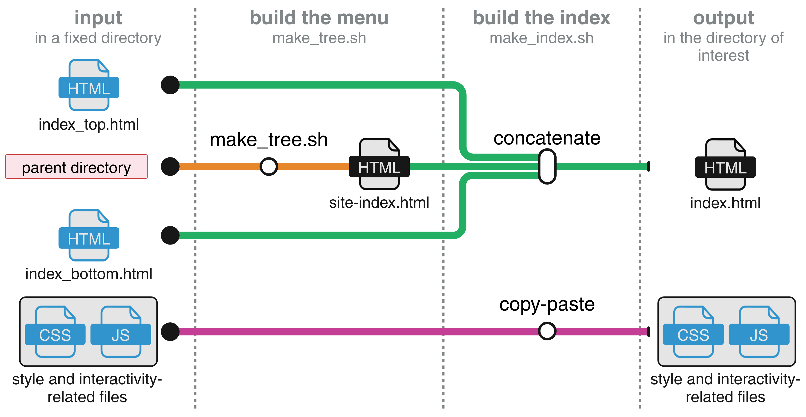

[](https://creativecommons.org/licenses/by-nc-sa/4.0/)
[](https://doi.org/10.5281/zenodo.15114752)


# Organize HTML files

This repository contains the necessary to build an `index.html` page. In practice, I use it to arrange the HTML files that have been obtained after rendering R Markdown notebooks.

The `index.html` page harbors this structure:

        ┌──────────┬───────────────┬───────────┐
        │ top left │     title     │ top right │
        ├───────┬──┴───────────────┴───────────┤
        │       │                              │
        │       │                              │
        │ menu  │           iframe             │
        │       │                              │
        │       │                              │
        └───────┴──────────────────────────────┘

* **top left corner** contains a clickable button to export the iframe content in a new tab
* **top right corner** contains the Github logo, redirecting to my Github home page
* **title** contains a string, redirecting to the `index.html` page itself
* **menu** contains a clickable menu, to open file in the iframe box
* **iframe** embeds a html file

This table was made using [https://plaintexttools.github.io/plain-text-table/](https://plaintexttools.github.io/plain-text-table/).

## Examples

* [https://audrey-onfroy.github.io/hs](https://audrey-onfroy.github.io/hs) *not yet public*
* [https://audrey-onfroy.github.io/hn](https://audrey-onfroy.github.io/hn) *not yet public*
* [https://audrey-onfroy.github.io/mpnst](https://audrey-onfroy.github.io/mpnst) *not yet public*
* [https://audrey-onfroy.github.io/12tips](https://audrey-onfroy.github.io/12tips) *not yet public*

## Repository content

This repository contains several files and folders:

* `make_index.sh`: bash **executable** file to build the `index.html` page

You may need to make the `make_index.sh` file executable:

```bash
chmod +u+x make_index.sh
```

* **index_build**: everything to build the `index.html` page:
  * `index_top.html`: html content to build the first row (top left, title, top right)
  * `index_bottom.html`: html content to build the iframe on the second row
  * `make_tree.sh`: bash **executable** file to build the menu list

You may need to make the `make_tree.sh` file executable:

```bash
chmod +u+x make_tree.sh
```

* **index_layout**: this folder is duplicated in your folder of interest. It contains:
  * **logo**:
    * Github logo for the top right corner
    * favicon for the tab logo, built using [https://favicon.io/favicon-converter/](https://favicon.io/favicon-converter/)
  * **pages**: some html pages that are always in the menu
    * `style.css`: for the `index.html` page to look beautiful
    * `functions.js`: JavaScript function to make the `index.html` page dynamic

* `copy_tree.sh`: bash **executable** file to copy all and only the html (or more!) pages into another directory, while respecting the directory tree. Very useful to share with other people.

## Usage of `make_index.sh`



Options of `make_index.sh`:

* **-b**: this directory, containing `make_index.sh` and the necessary files
* **-r**: **root** of the directory to make the menu for
* **-m**: name of the intermediate **menu** file, will be deleted in the end(eg. `site-index.html`)
* **-i**: elements to **ignore** while making the menu
* **-o**: name of the **output** page (eg. `index.html`)

Usage :

```bash
./make_index.sh \
-b pathto/git_book/ \
-r pathto/dir_of_interest/ \
-m pathto/git_book/site-index.html \
-i "/libs/|/index_layout/|index.html" \
-o pathto/dir_of_interest/index.html
```

The executable file `make_index.sh` builds the `index.html` page by running `make_tree.sh` file, and concatenaning the three index subfiles (`index_top.html`, then `site-index.html`, then `index_bottom.html`). Everything, except the iframe box content, is written in the `index.html` file. The iframe content is elsewhere on the computer. This is just an embedding.

### Included in `make_index.sh`

The executable file `make_tree.sh` generates the menu, as a list, in a `site-index.html` file. The menu list is not perfect. You may want to edit it, to simplify it, or rename items, directly in the `index.html` file. The executable `make_tree.sh` asks three parameters:

* `-r` is the root directory to make tree on
* `-o` is the output file names, with full path
* `-i` is a regular expression with pattern to ignore in the tree

## Customization

One may need to customize the index.html page.

### Colors

To change the color theme (first row banner + menu):

1) go to `style.css`
2) in the `.first-row` style, change the `background-color` value
3) in the `ul,li` style, change the `color` value

### Github logo

To switch the Github logo to a black or white picture:

1) go to `style.css`
2) in the `.github` style, switch the `background-image` url to:

* `./logo/github-mark-white.svg` for 
* `./logo/github-mark.svg` for 

### Website logo

To customize the logo, appearing in a browser tab:

1) go, for instance, on [https://favicon.io/](https://favicon.io/)
2) build and download your logo
3) in the `./index_layout/logo` folder, replace the `favicon.ico` file

Note: in the `index.html` file, the logo is declared at the **line 11**, containing `<link rel="icon" type="image/x-icon" href="./index_layout/logo/favicon.ico">`.

### Titles and links

Titles and links are declared in the `index.hml` file:

|          what                | line in index.html |       where              |
|:----------------------------:|:----------:|:--------------------------------:|
|    title in the browser tab  |    12      | between `<title>` and `</title>` |
|    title in the top banner   |    40      | between `<a ....>` and `</a>`    |
|    link to Github            |    45      | after `href=`                    |

### Menu items

By default, the menu contains only first-level and second-level items, named according to the directory or file names. For instance, the directory:

```bash
├── first
│   ├── file1.html
│   └── file2.html
└── second
    ├── file1.html
    └── file2.html
          └── third
              ├── file1.html
              └── file2.html
```

will be translated in the `index.html` file into:

```html
<ul>
        <li>first</li>
        <ul>
                <li><button id='./first/file1.html' class='ulli_button' onClick="changeIframe('./first/file1.html')">file1</button></li>
                <li><button id='./first/file2.html' class='ulli_button' onClick="changeIframe('./first/file2.html')">file2</button></li>
        </ul>
        <li>second</li>
        <ul>
                <li><button id='./second/file1.html' class='ulli_button' onClick="changeIframe('./second/file1.html')">file1</button></li>
                <li><button id='./second/file2.html' class='ulli_button' onClick="changeIframe('./second/file2.html')">file2</button></li>
                <li>second/third</li>
                <ul>
                        <li><button id='./second/third/file1.html' class='ulli_button' onClick="changeIframe('./second/third/file1.html')">file1</button></li>
                        <li><button id='./second/third/file2.html' class='ulli_button' onClick="changeIframe('./second/third/file2.html')">file2</button></li>
                </ul>
        </ul>
</ul>
```

A possible modification consists in doing:

```html
<ul>
        <li>Toto</li>
        <ul>
                <li><button id='./first/file1.html' class='ulli_button' onClick="changeIframe('./first/file1.html')">Toto 1</button></li>
                <li><button id='./first/file2.html' class='ulli_button' onClick="changeIframe('./first/file2.html')">Toto 2</button></li>
        </ul>
        <li>Tata</li>
        <ul>
                <li><button id='./second/file1.html' class='ulli_button' onClick="changeIframe('./second/file1.html')">Tata 1</button></li>
                <li><button id='./second/file2.html' class='ulli_button' onClick="changeIframe('./second/file2.html')">Tata 2</button></li>
        </ul>
        <li>Titi</li>
        <ul>
                <li><button id='./second/third/file1.html' class='ulli_button' onClick="changeIframe('./second/third/file1.html')">Titi 1</button></li>
                <li><button id='./second/third/file2.html' class='ulli_button' onClick="changeIframe('./second/third/file2.html')">Titi 2</button></li>
        </ul>
</ul>
```

ie:

* changing the names of the items
* decrementing the third folder

### Folding menu

In the default version, the menu in `index.html` is defined as follows:

```html
<li>main</li>
<ul>
        <li><button id='./file1.html' class='ulli_button' onClick="changeIframe('./file1.html')">file1.html</button></li>
        <li><button id='./file2.html' class='ulli_button' onClick="changeIframe('./file2.html')">file2.html</button></li>
</ul>
```

To make a list foldable, with a default to "hidden", modify to:

```html
<li><a onClick="toggleSwitch(this)">main &#9662;</a>
        <ul style="display:none">
                <li><button id='./file1.html' class='ulli_button' onClick="changeIframe('./file1.html')">file1.html</button></li>
                <li><button id='./file2.html' class='ulli_button' onClick="changeIframe('./file2.html')">file2.html</button></li>
        </ul>
</li>
```

## Usage of `copy_tree.sh`

Options of `copy_tree.sh`:

* **-i**: input directory containing several html files (of interest) and other files not of interest
* **-o**: output directory to replicate the tree of html files
* **-w**: (optional) include the whole content of a folder. The path should be relative to input. This option is currently suited for only one folder.
* **-e**: (optional) copy the files matching a specific regex (default to ".*html")

Usage :

```bash
./copy_tree.sh \
-i pathto/input_directory/ \
-o pathto/output_directory/ \
-w of_interest \
-e ".*html\|.*pdf"
```

The last line illustrates the option to copy all files ending with html or pdf. Note that the command using the -e EXTENSION option (with the the -i INPUT parameter) is:

```bash
find $INPUT -regex $EXTENSION -type f
```

Example of input directory tree:

```bash
├── first
│   ├── file1.html
│   ├── file1.Rmd
│   ├── file2.html
│   ├── file2.Rmd
│   └── toto.rds
├── second
│   ├── file1.html
│   ├── file1.Rmd
│   ├── file2.html
│   ├── file2.Rmd
│   ├── titi.rda
│   ├── tata.txt
│   └── third
│      ├── file1.html
│      └── file2.html
├── index_layout
│   ├── functions.js
│   ├── logo
│   │   ├── favicon.ico
│   │   ├── github-mark.png
│   │   ├── github-mark.svg
│   │   ├── github-mark-white.png
│   │   └── github-mark-white.svg
│   ├── pages
│   │   └── first.html
│   └── style.css
└── index.html
```

The purpose of the `copy_tree` command is to replicate the tree of html files in an ouput directory:

```bash
├── first
│   ├── file1.html
│   └── file2.html
├── second
│   ├── file1.html
│   ├── file2.html
│   └── third
│      ├── file1.html
│      └── file2.html
├── index_layout
│   └── pages
│       └── first.html
└── index.html
```

**Important**: To include the full `index_layout` folder in the output directory, use the option `-w index_layout` (**w**ith). Otherwise, styles will be missing.

## Other tools ?

One may be interested in:

* **bookdown**: [https://bookdown.org/](https://bookdown.org/)
* **blogdown**: [https://bookdown.org/yihui/blogdown/](https://bookdown.org/yihui/blogdown/)
* **pkgdown**: [https://pkgdown.r-lib.org/](https://pkgdown.r-lib.org/)
* **gitbook**: [https://gitbook-ng.github.io/](https://gitbook-ng.github.io/)
* **quarto**: [https://quarto.org/docs/websites/](https://quarto.org/docs/websites/)

<br><br>

|  | Except where otherwise noted, this work is licensed under <br> [https://creativecommons.org/licenses/by-nc-sa/4.0/](https://creativecommons.org/licenses/by-nc-sa/4.0/) |
|:----:|:---:|

# Citing

To cite this work, please use:

```
Audrey Onfroy, OrganizeHTML: a command-line tool to build an index page for a existing folder tree of HTML files. DOI: https://doi.org/10.5281/zenodo.14505635
```
