<style>
body {
text-align: justify}
</style>


<!-- Set default parameters for all chunks -->


# Context

The goal of this script is to compare single-cell RNA sequencing (scRNA-Seq) data from two mouse tumors :

* The first mouse was carrying a dNF. This tumor has been split. One part has been used to generate scRNA-Seq data : dataset **2020_18**. The other has been processed in order to be grafted on a nude recipient.
* The nude recipient developed a MPNST from the grafted tumor cells. scRNA-Seq data has been generated from cells from this tumor : dataset **2020_23**.

In this file, we generate a Seurat object containing both datasets, from their respective raw count matrices. We will run the following steps :

* merge the dataset using the `base::merge` function
* removal of cells with few genes or few UMI
* removal of genes having counts in less than 5 cells
* normalization with `LogNormalize`, then doublets detection using `scran hybrid` and `scDblFinder` method, and doublet cells removal
* normalization with `LogNormalize`, for only the remaining cells
* cell cycle and cell type annotation
* dimensionality reduction using `PCA`
* batch-effect removal using `harmony`

# Set environment


```r
library(dplyr)
library(ggplot2)
library(patchwork)
```

We load the parameters :


```r
input_dir = params$input_dir
out_dir = params$out_dir
```

Data are stored there : .
Input count matrices come from there : /home/aurelien/Documents/Audrey/git_analysis/MPNST_paper/analysis/nextflow/graft/input/


```r
save_name = "donor18_recipient23"
```

We will load two datasets :


```r
sample_info = data.frame(project_name = c("2020_18", "2020_23"), 
                         tumor_type = c("dyNF", "MPNST"),
                         sample_identifiant = c("donor", "recipient"),
                         color = c("#1B9E77", "#D95F02"), # from RColorBrewer::brewer.pal("Dark2", n = 3)
                         stringsAsFactors = FALSE)

save(sample_info, file = paste0(out_dir, "/", save_name, "_sample_info.rda"))

ggplot2::ggplot(sample_info) +
  ggplot2::geom_label(aes(x = project_name, y = 0, label = project_name, fill = project_name)) +
  ggplot2::geom_text(aes(x = project_name, y = 1, label = sample_identifiant)) +
  ggplot2::lims(y = c(-1, 2)) +
  ggplot2::scale_fill_manual(values = sample_info$color, breaks = sample_info$project_name) +
  ggplot2::theme_void() +
  ggplot2::theme(legend.position = "none")
```


We load the markers and specific colors for each cell type :


```r
cell_markers = aquarius:::cell_markers
cell_markers[["keratinocytes"]] = NULL

lengths(cell_markers)
```

```
##           tumor cells           macrophages                   cDC 
##                   129                    51                    66 
##                   mDC                   pDC               T cells 
##                    25                    99                    26 
##              NK cells           neutrophils            mast cells 
##                    24                    12                    26 
##               B cells     endothelial cells           fibroblasts 
##                    22                    60                   109 
##           mural cells skeletal muscle cells 
##                    59                    42
```

Here are custom colors for each cell type :


```{.r .fold-hide}
color_markers = aquarius:::color_markers
color_markers = color_markers[names(cell_markers)]

save(color_markers, file = paste0(out_dir, "/color_markers.rda"))

data.frame(cell_type = names(color_markers),
           color = unlist(color_markers)) %>%
  ggplot2::ggplot(., aes(x = cell_type, y = 0, fill = cell_type)) +
  ggplot2::geom_point(pch = 21, size = 5) +
  ggplot2::scale_fill_manual(values = unlist(color_markers), breaks = names(color_markers)) +
  ggplot2::theme_classic() +
  ggplot2::theme(legend.position = "none",
                 axis.line = element_blank(),
                 axis.title = element_blank(),
                 axis.ticks = element_blank(),
                 axis.text.y = element_blank())
```

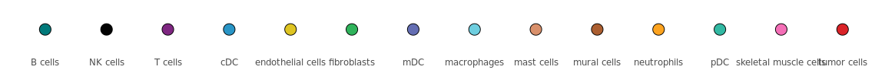

Here a the markers to make a dotplot :


```r
dotplot_markers = list("pDC" = c("Siglech", "Ly6d"),
                       "mDC" = c("Cd209a", "Mgl2", "Olfm1"),
                       "cDC" = c("Xcr1", "Itgae"),
                       "mast cells" = c("Tpsb2", "Cpa3", "Cma1", "Mcpt4"),
                       "neutrophils" = c("S100a8", "S100a9", "Cxcl2"),
                       "B cells" = c("Cd79a", "Cd79b", "Ly6d"),
                       "NK cells" = c("Xcl1", "Klre1", "Klrb1c"),
                       "T cells" = c("Cd4", "Cd8a", "Cd3e", "Cd3d"),
                       "macrophages" = c("Adgre1", "Csf1r", "Mafb"),
                       "skeletal muscle cells" = c("Acta1", "Tnnc2", "Tnnt3", "Myl1"),
                       "mural cells" = c("Notch3", "Rgs5", "Pdgfrb"),
                       "endothelial cells" = c("Egfl7", "Cdh5", "Pecam1"),
                       "fibroblasts" = c("Dcn", "Mgp"),
                       "tumor cells" = c("Plp1", "Ank3", "Gas1", "Pdgfrb", "Kcna1", "Sox10", "Sox9", "Pdgfra"))
cell_type_levels = names(dotplot_markers)
```

These is a parameter for different functions :


```r
cl = aquarius::create_parallel_instance(nthreads = 3L)
```


# Combine datasets

In this section, we load the raw count matrix for each sample. Then, we applied an empty droplets filtering. Then, we use `base::merge` function to make a combined Seurat object containing all datasets. For each sample, identifier corresponds to the `sample_info$sample_identifiant` value.


```r
data_paths = paste0(input_dir, "/", sample_info$project_name)
names(data_paths) = sample_info$sample_identifiant

sobj = aquarius::integration_combine_datasets_from_matrices(data_paths = data_paths,
                                                            save_sobj = paste0(out_dir, "/all_DietSeurat_objects.rda"))
```

```
## [1]   28000 6794880
## [1] 35313328
## [1] 28000  3851
## [1] 31219611
## [1] 0.8840744
## [1]   28000 6794880
## [1] 47814763
## [1] 28000  4576
## [1] 44214901
## [1] 0.9247123
```

```r
sobj
```

```
## An object of class Seurat 
## 28000 features across 8427 samples within 1 assay 
## Active assay: RNA (28000 features, 0 variable features)
```

(Time to run : 336.25 s)

This is the number of cells for each dataset :


```r
table(sobj$orig.ident)
```


We set the levels of orig.ident :


```r
sobj$orig.ident = factor(sobj$orig.ident,
                         levels = sample_info$sample_identifiant)
```

We add a tumor type column :


```r
sobj$tumor_type = dplyr::left_join(x = sobj@meta.data,
                                   y = sample_info,
                                   by = c("orig.ident" = "sample_identifiant")) %>%
  dplyr::pull(tumor_type) %>%
  as.character() %>% factor(., levels = c("dyNF", "MPNST"))
```

We add a project name column :


```r
sobj$project_name = dplyr::left_join(x = sobj@meta.data,
                                     y = sample_info,
                                     by = c("orig.ident" = "sample_identifiant")) %>%
  dplyr::pull(project_name)
```

We save the combined dataset. It is not annotated and not filtered, except for empty droplets.


```r
saveRDS(sobj, paste0(out_dir, "/", save_name, "_sobj_unfiltered.rds"))
```


# Before filtering

## Gene expression normalization


```r
sobj = aquarius::sc_normalization(sobj = sobj,
                                  assay = "RNA",
                                  method = "LogNormalize",
                                  verbose = FALSE)
```


## Cell type

We annotate cells for cell type using `Seurat::AddModuleScore` function.


```r
sobj = aquarius::cell_annot_custom(sobj,
                                   newname = "cell_type",
                                   markers = cell_markers,
                                   use_negative = TRUE,
                                   add_score = TRUE,
                                   verbose = TRUE)

colnames(sobj@meta.data) = stringr::str_replace_all(string = colnames(sobj@meta.data),
                                                    pattern = " ",
                                                    replacement = "_")

sobj$cell_type = factor(sobj$cell_type, levels = cell_type_levels)

table(sobj$cell_type)
```

```
## 
##                   pDC                   mDC                   cDC 
##                    31                   172                   108 
##            mast cells           neutrophils               B cells 
##                    21                   492                    50 
##              NK cells               T cells           macrophages 
##                    46                   136                  1267 
## skeletal muscle cells           mural cells     endothelial cells 
##                    70                    58                   201 
##           fibroblasts           tumor cells 
##                   605                  5170
```

(Time to run : 46.17 s)


To justify cell type annotation, we can make a dotplot :


```r
markers = unique(unlist(dotplot_markers[levels(sobj$cell_type)]))

aquarius::plot_dotplot(sobj, assay = "RNA",
                       column_name = "cell_type",
                       markers = c("Ptprc", markers, "dtTomato"),
                       nb_hline = 0) +
  ggplot2::scale_color_gradientn(colors = c("lightgray", "#FDBB84", "#EF6548", "#7F0000", "black")) +
  ggplot2::labs(x = "Cell type", y = "") +
  ggplot2::theme(legend.position = "right",
                 legend.box = "vertical",
                 legend.direction = "vertical") +
  ggplot2::geom_vline(xintercept = 0.5 + c(8, 12, 16, 17, 20, 23, 26, 29,
                                           33, 36, 38, 41, 43, 46, 47),
                      color = "gray92")
```

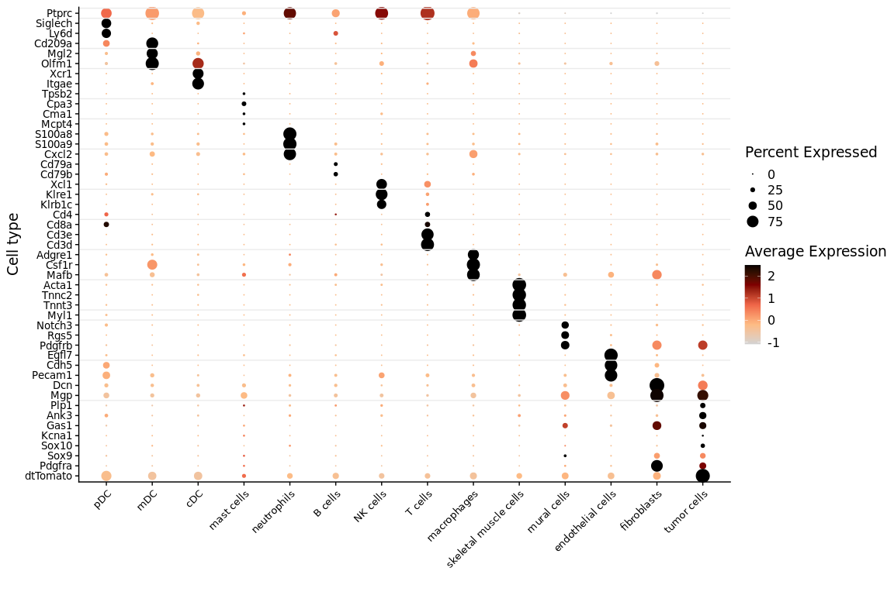

We can make a barplot to see the composition of each dataset.


```r
df_proportion = as.data.frame(prop.table(table(sobj$orig.ident,
                                               sobj$cell_type)))
colnames(df_proportion) = c("orig.ident", "cell_type", "freq")

quantif = table(sobj$orig.ident) %>%
  as.data.frame.table() %>%
  `colnames<-`(c("orig.ident", "nb_cells"))

aquarius::plot_barplot(df = df_proportion,
                       x = "orig.ident",
                       y = "freq",
                       fill = "cell_type",
                       position = ggplot2::position_fill()) +
  ggplot2::scale_fill_manual(name = "Cell type",
                             values = color_markers[levels(df_proportion$cell_type)],
                             breaks = levels(df_proportion$cell_type)) +
  ggplot2::geom_label(data = quantif, inherit.aes = FALSE,
                      aes(x = orig.ident, y = 1.05, label = nb_cells),
                      label.size = 0)
```

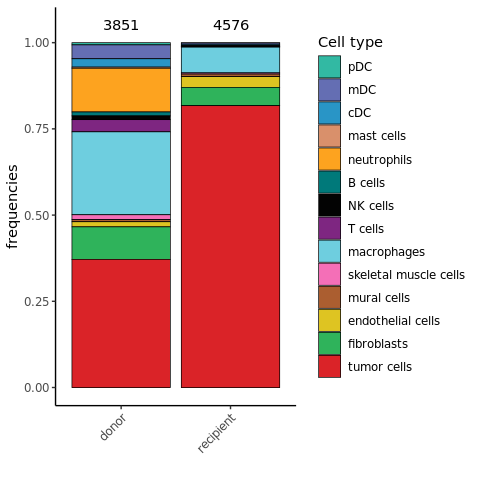


## Cell cycle phase

We annotate cells for cell cycle phase using `Seurat` and `cyclone`.


```r
cc_columns = aquarius::add_cell_cycle(sobj = sobj,
                                      assay = "RNA",
                                      species_rdx = "mm",
                                      BPPARAM = cl)@meta.data[, c("Seurat.Phase", "Phase")]
```

```
## 
##   G1  G2M    S 
## 7810  541   64
```

```r
sobj$Seurat.Phase = cc_columns$Seurat.Phase
sobj$cyclone.Phase = cc_columns$Phase

table(sobj$Seurat.Phase, sobj$cyclone.Phase)
```

```
##      
##         G1  G2M    S
##   G1  5158   75   25
##   G2M  868  423   27
##   S   1784   43   12
```


## Quality control

In this section, we look at the number of genes expressed by each cell, the number of UMI, the percentage of mitochondrial genes expressed, and the percentage of ribosomal genes expressed. Then, without taking into account the cells expressing low number of genes or have low number of UMI, we identify doublet cells.

We compute four quality metrics :


```r
sobj = aquarius::add_QC_metrics(sobj = sobj,
                                species_rdx = "mm",
                                BPPARAM = cl)
```


### Visualization

#### Number of UMI

To visualize the threshold for number of UMI, we can make a histogram :


```{.r .fold-hide}
ggplot(sobj@meta.data, aes(x = log_nCount_RNA)) +
  geom_histogram(aes(y = ..density..), colour = "black", fill = "white", bins = 200) +
  geom_density(alpha = 0.2, fill = "#FF6666") +
  ggplot2::theme_classic()
```

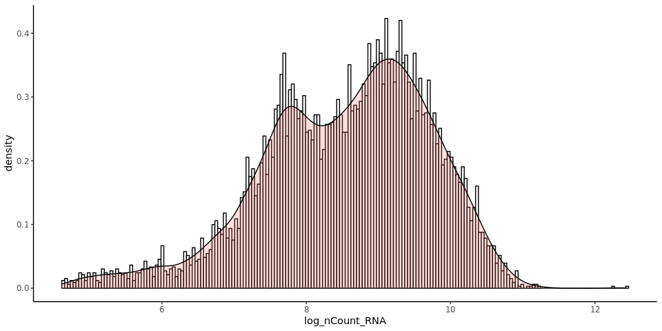

We can also visualize these as a violin plot :


```r
Seurat::VlnPlot(sobj, features = "log_nCount_RNA", pt.size = 0.001,
                group.by = "orig.ident", cols = sample_info$color) +
  ggplot2::labs(x = "")
```

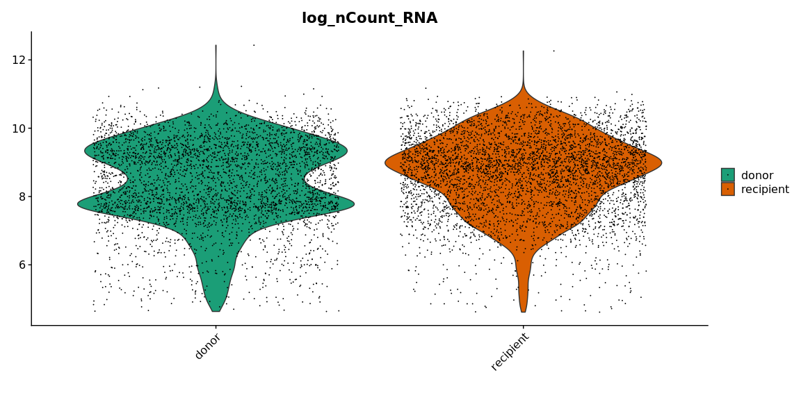


```r
Seurat::VlnPlot(sobj, features = "log_nCount_RNA", pt.size = 0.001,
                group.by = "cell_type", cols = color_markers) +
  ggplot2::scale_fill_manual(values = color_markers, breaks = names(color_markers)) +
  ggplot2::labs(x = "")
```

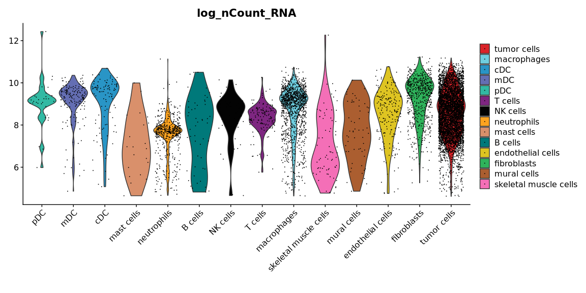


#### Number of features

To visualize the threshold for number of features, we can make a histogram :


```{.r .fold-hide}
ggplot(sobj@meta.data, aes(x = nFeature_RNA)) +
  geom_histogram(aes(y = ..density..), colour = "black", fill = "white", bins = 200) +
  geom_density(alpha = 0.2, fill = "#FF6666") +
  ggplot2::theme_classic()
```

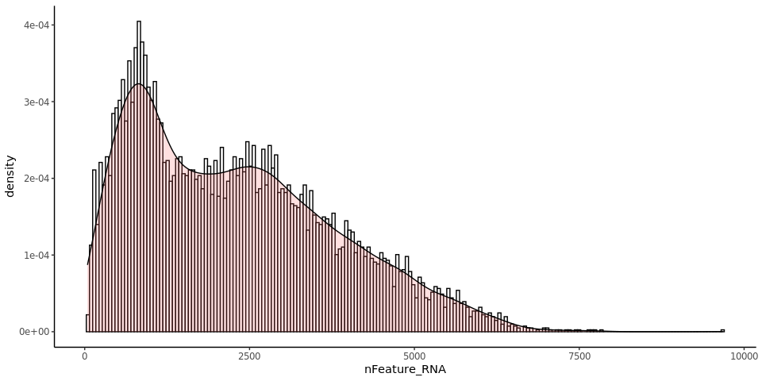

We can also visualize these as a violin plot :


```r
Seurat::VlnPlot(sobj, features = "nFeature_RNA", pt.size = 0.001,
                group.by = "orig.ident", cols = sample_info$color) +
  ggplot2::labs(x = "")
```

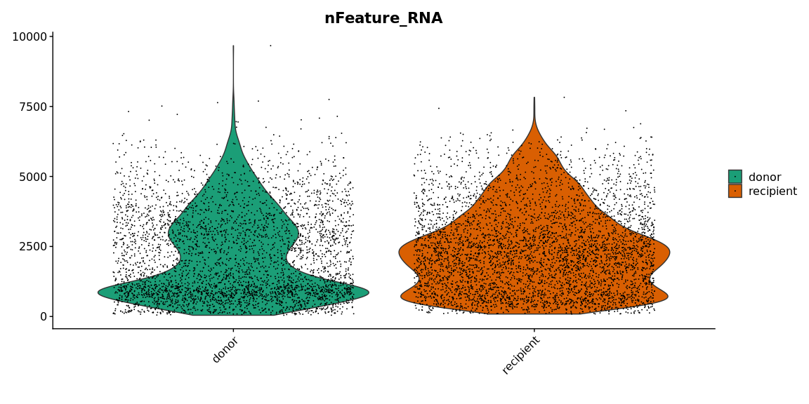


```r
Seurat::VlnPlot(sobj, features = "nFeature_RNA", pt.size = 0.001,
                group.by = "cell_type", cols = color_markers) +
  ggplot2::scale_fill_manual(values = color_markers, breaks = names(color_markers)) +
  ggplot2::labs(x = "")
```

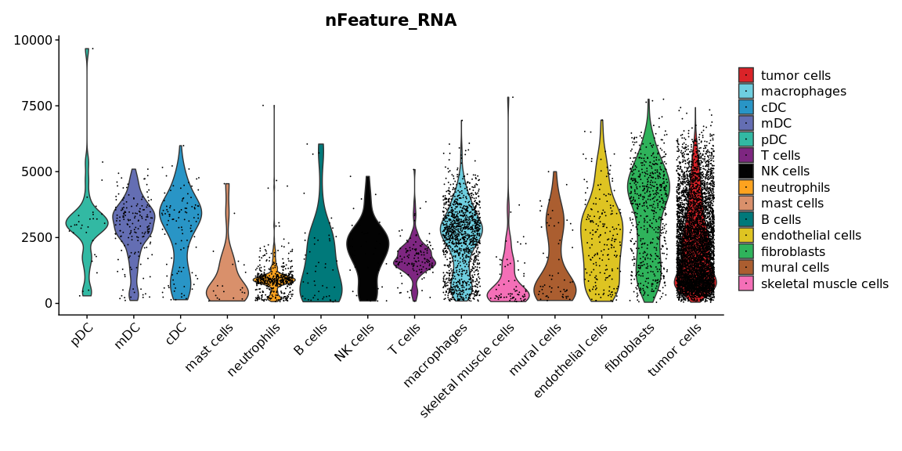


#### Mitochondrial genes expression

To identify a threshold for mitochondrial gene expression, we can make a histogram :


```{.r .fold-hide}
ggplot(sobj@meta.data, aes(x = percent.mt)) +
  geom_histogram(aes(y = ..density..), colour = "black", fill = "white", bins = 200) +
  geom_density(alpha = 0.2, fill = "#FF6666") +
  ggplot2::theme_classic()
```

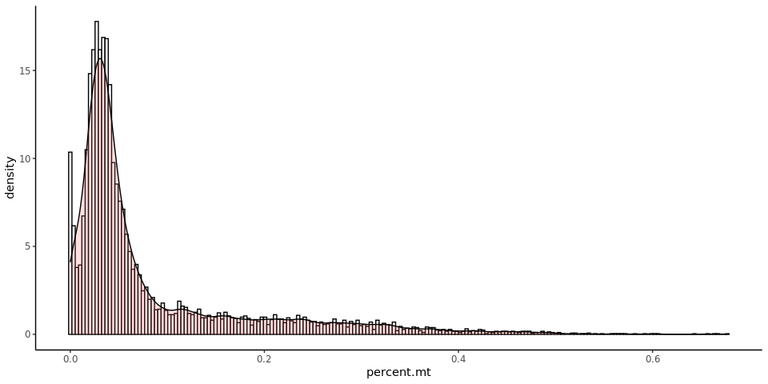

We can also visualize these as a violin plot :


```r
Seurat::VlnPlot(sobj, features = "percent.mt", pt.size = 0.001,
                group.by = "orig.ident", cols = sample_info$color) +
  ggplot2::labs(x = "")
```

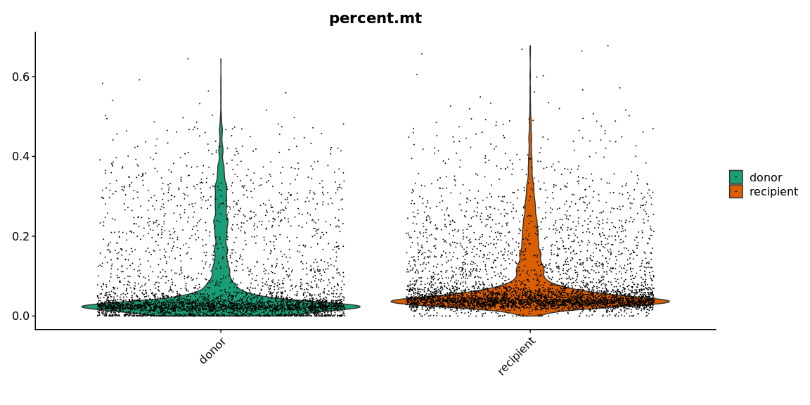


```r
Seurat::VlnPlot(sobj, features = "percent.mt", pt.size = 0.001,
                group.by = "cell_type", cols = color_markers) +
  ggplot2::scale_fill_manual(values = color_markers, breaks = names(color_markers)) +
  ggplot2::labs(x = "")
```

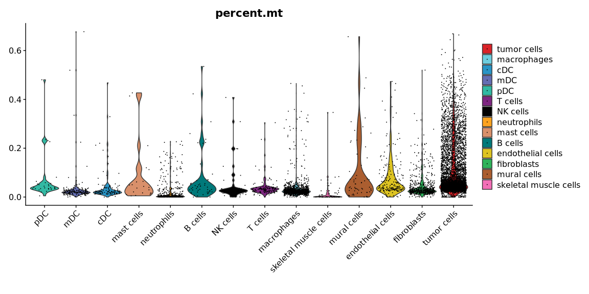


#### Ribosomal genes expression

To identify a threshold for ribosomal gene expression, we can make a histogram :


```{.r .fold-hide}
ggplot(sobj@meta.data, aes(x = percent.rb)) +
  geom_histogram(aes(y = ..density..), colour = "black", fill = "white", bins = 200) +
  geom_density(alpha = 0.2, fill = "#FF6666") +
  ggplot2::theme_classic() 
```

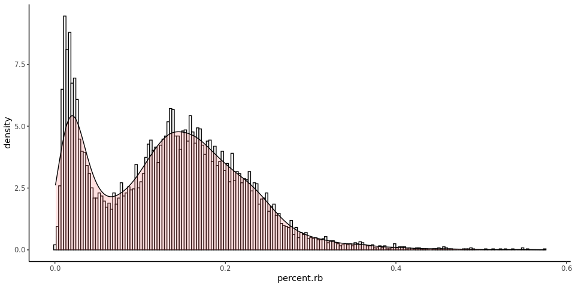

We can also visualize these as a violin plot :


```r
Seurat::VlnPlot(sobj, features = "percent.rb", pt.size = 0.001,
                group.by = "orig.ident", cols = sample_info$color) +
  ggplot2::labs(x = "")
```

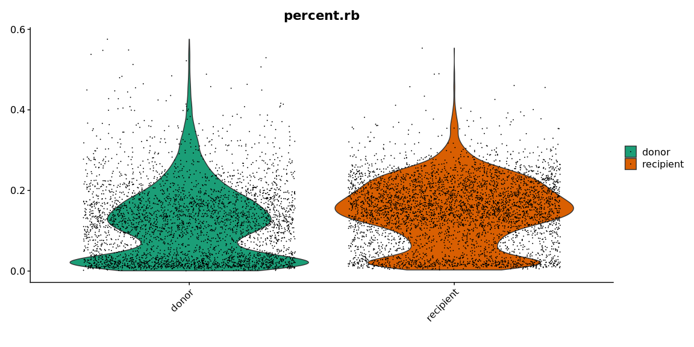


```r
Seurat::VlnPlot(sobj, features = "percent.rb", pt.size = 0.001,
                group.by = "cell_type", cols = color_markers) +
  ggplot2::scale_fill_manual(values = color_markers, breaks = names(color_markers)) +
  ggplot2::labs(x = "")
```

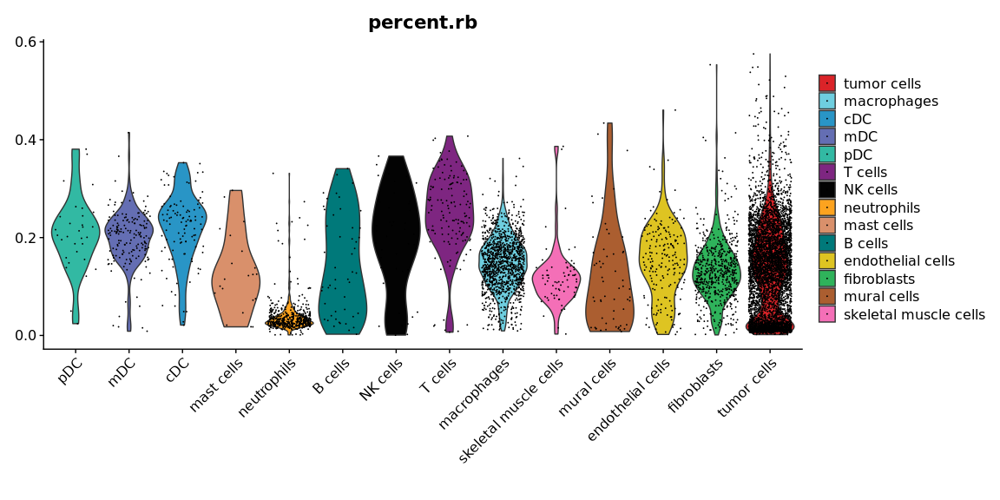

### QC thresholds

We set threshold for each metric :


```r
sobj$all_cells = TRUE

cut_log_nCount_RNA = 6.34
cut_nFeature_RNA = 626
cut_percent.mt = 0.1
cut_percent.rb = 0.3
```

We get the cell barcodes for the failing cells :


```r
fail_percent.mt = sobj@meta.data %>% dplyr::filter(percent.mt > cut_percent.mt) %>% rownames()
fail_percent.rb = sobj@meta.data %>% dplyr::filter(percent.rb > cut_percent.rb) %>% rownames()
fail_log_nCount_RNA = sobj@meta.data %>% dplyr::filter(log_nCount_RNA < cut_log_nCount_RNA) %>% rownames()
fail_nFeature_RNA = sobj@meta.data %>% dplyr::filter(nFeature_RNA < cut_nFeature_RNA) %>% rownames()
```

We can visualize the 4 cells quality with a Venn diagram : 


```{.r .fold-hide}
ggvenn::ggvenn(list(percent.mt = fail_percent.mt,
                    percent.rb = fail_percent.rb,
                    log_nCount_RNA = fail_log_nCount_RNA,
                    nFeature_RNA = fail_nFeature_RNA), 
               fill_color = c("#0073C2FF", "#EFC000FF", "orange", "pink"),
               stroke_size = 0.5, set_name_size = 4) +
  ggplot2::ggtitle(label = "Filtered out cells") +
  ggplot2::theme(plot.title = element_text(hjust = 0.5, face = "bold"))
```

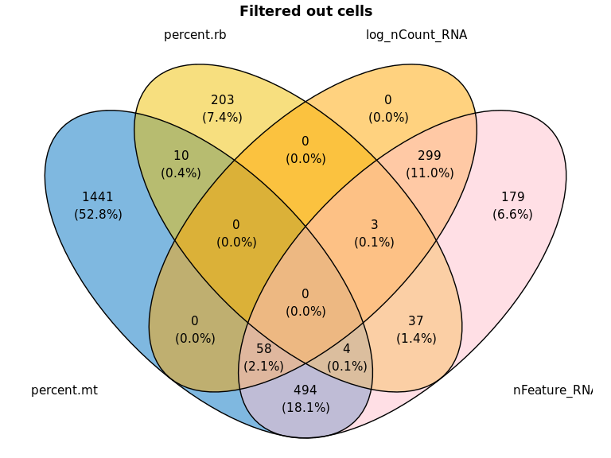

### Doublet cells

#### Detection

Without taking into account the low UMI and low number of features cells, we identify doublets.


```r
fsobj = subset(sobj, invert = TRUE,
               cells = unique(c(fail_log_nCount_RNA, fail_nFeature_RNA)))
fsobj
```

```
## An object of class Seurat 
## 28000 features across 7353 samples within 1 assay 
## Active assay: RNA (28000 features, 3000 variable features)
```

On this filtered dataset, we apply doublet cells detection. Just before, we run the normalization, taking into account only the remaining cells.


```r
fsobj = aquarius::sc_normalization(sobj = fsobj,
                                   assay = "RNA",
                                   method = "LogNormalize",
                                   verbose = FALSE)
```

We identify doublet cells :


```r
fsobj = aquarius::find_doublets(sobj = fsobj,
                                BPPARAM = cl)
```

```
## [1] 28000  7353
## 
## FALSE  TRUE 
##  6837   516 
## [16:20:36] WARNING: amalgamation/../src/learner.cc:1095: Starting in XGBoost 1.3.0, the default evaluation metric used with the objective 'binary:logistic' was changed from 'error' to 'logloss'. Explicitly set eval_metric if you'd like to restore the old behavior.
## 
## FALSE  TRUE 
##  6779   574 
## 
## FALSE  TRUE 
##  6482   871
```

```r
fail_doublets_consensus = Seurat::WhichCells(fsobj, expression = doublets_consensus.class)
fail_doublets_scDblFinder = Seurat::WhichCells(fsobj, expression = scDblFinder.class)
fail_doublets_hybrid = Seurat::WhichCells(fsobj, expression = hybrid_score.class)
```

(Time to run : 139.58 s)

We add the information in the non filtered Seurat object :


```r
sobj$doublets_consensus.class = dplyr::case_when(!(colnames(sobj) %in% colnames(fsobj)) ~ NA,
                                                 colnames(sobj) %in% fail_doublets_consensus ~ TRUE,
                                                 !(colnames(sobj) %in% fail_doublets_consensus) ~ FALSE)

sobj$scDblFinder.class = dplyr::case_when(!(colnames(sobj) %in% colnames(fsobj)) ~ NA,
                                          colnames(sobj) %in% fail_doublets_scDblFinder ~ TRUE,
                                          !(colnames(sobj) %in% fail_doublets_scDblFinder) ~ FALSE)

sobj$hybrid_score.class = dplyr::case_when(!(colnames(sobj) %in% colnames(fsobj)) ~ NA,
                                           colnames(sobj) %in% fail_doublets_hybrid ~ TRUE,
                                           !(colnames(sobj) %in% fail_doublets_hybrid) ~ FALSE)
```


#### Visualization

We can compare doublet detection methods with a Venn diagram : 


```{.r .fold-hide}
ggvenn::ggvenn(list(hybrid = fail_doublets_hybrid,
                    scDblFinder = fail_doublets_scDblFinder), 
               fill_color = c("#0073C2FF", "#EFC000FF"),
               stroke_size = 0.5, set_name_size = 4) +
  ggplot2::ggtitle(label = "Doublet cells") +
  ggplot2::theme(plot.title = element_text(hjust = 0.5, face = "bold"))
```

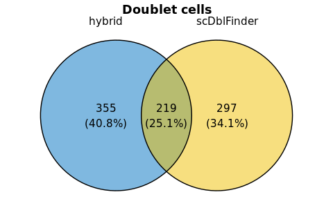

How many doublet are detected for each sample of origin ?


```r
round(100*prop.table(table(sobj$doublets_consensus.class, sobj$orig.ident), margin = 2), 2)
```

```
##        
##         donor recipient
##   FALSE 89.21     87.30
##   TRUE  10.79     12.70
```


What is the composition of doublet cells ?


```{.r .fold-hide}
sobj$orig.ident.doublets = case_when(is.na(sobj$doublets_consensus.class) ~ "bad quality",
                                     sobj$doublets_consensus.class == TRUE ~ paste0(sobj$orig.ident, " doublets"),
                                     sobj$doublets_consensus.class == FALSE ~ "not doublet")
sobj$orig.ident.doublets = factor(sobj$orig.ident.doublets,
                                  levels = c(paste0(as.character(sample_info$sample_identifiant), " doublets"),
                                             "bad quality", "not doublet"))

doublets_compo = function(score1, score2) {
  type1 = unlist(lapply(stringr::str_split(score1, pattern = "score_"), `[[`, 2))
  type2 = unlist(lapply(stringr::str_split(score2, pattern = "score_"), `[[`, 2))
  
  if (type1 == type2) {
    the_title = "Homotypic doublet"
    the_subtitle = type1
    score1 = "log_nCount_RNA"
  } else {
    the_title = "Heterotypic doublet"
    the_subtitle = paste(type1, type2, sep = " + ")
  }
  
  p = sobj@meta.data %>%
    dplyr::arrange(desc(orig.ident.doublets)) %>%
    ggplot2::ggplot(., aes(x = eval(parse(text = score1)),
                           y = eval(parse(text = score2)),
                           col = orig.ident.doublets)) +
    ggplot2::geom_point(size = 0.25) +
    ggplot2::scale_color_manual(values = c(sample_info$color, "gray90", "gray60"),
                                breaks = c(paste0(as.character(sample_info$sample_identifiant), " doublets"),
                                           "bad quality", "not doublet")) +
    ggplot2::labs(x = score1, y = score2,
                  title = the_title, subtitle = the_subtitle) +
    ggplot2::theme_classic() +
    ggplot2::theme(aspect.ratio = 1,
                   plot.title = element_text(hjust = 0.5),
                   plot.subtitle = element_text(hjust = 0.5))
  
  return(p)
}
```


On the plots below, we visualize all cells. Cells with low count and low number of features are in light gray. Single cells are in dark gray. Droplets annotated as doublet cells are colored by sample of origin. To investigate **homotypic doublet cells**, we represent the cell type score as a function of the number of UMI If there is a homotypic doublet, there will be a cloud of cells with a high score for the cell type, a high number of UMI. To investigate **heterotypic doublet cells**, we represent the two cell type scores. If doublet cells between the two cell types exists, we will observe single cell with one high score and one low score (top left corner or bottom right corner), and a cloud of cells with two high scores (top right corner). A cloud of cells with two low scores (bottom left corner) means that cells are not from the two cell types. If there is not top left or bottom right corner, but only top right and / or bottom left, it means that the two cell types are correlated, and cannot be interpreted as doublet cells.


```{.r .fold-hide}
score_columns = grep(x = colnames(sobj@meta.data),
                     pattern = "^score",
                     value = TRUE)
combinations = expand.grid(score_columns, score_columns) %>%
  apply(., 1, sort) %>% t() %>%
  as.data.frame()
combinations = combinations[!duplicated(combinations), ]

plot_list = apply(combinations, 1, FUN = function(elem) {
  doublets_compo(elem[1], elem[2])
})

sobj$orig.ident.doublets = NULL
```


```r
patchwork::wrap_plots(plot_list, ncol = 4) +
  patchwork::plot_layout(guides = "collect") &
  ggplot2::theme(legend.position = "right")
```

<details><summary>show</summary>

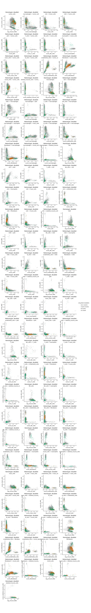

</details>


### FACS-like figure

We would like to see if the number of feature expressed by cell, and the number of UMI is correlated with the cell type, the percentage of mitonchondrial and ribosomal gene detected, and the doublet status. We build the `log_nCount_RNA` by `nFeature_RNA` figure, where cells (dots) are colored by these different metrics.

We prepare the figure :


```{.r .fold-hide}
pass_log_nCount_RNA = sobj@meta.data$log_nCount_RNA > cut_log_nCount_RNA
pass_nFeature_RNA = sobj@meta.data$nFeature_RNA > cut_nFeature_RNA

minus_minus = intersect(which(!(pass_log_nCount_RNA)), which(!pass_nFeature_RNA)) %>% length()
minus_plus = intersect(which(pass_log_nCount_RNA), which(!pass_nFeature_RNA)) %>% length()
plus_minus = intersect(which(!pass_log_nCount_RNA), which(pass_nFeature_RNA)) %>% length()
plus_plus = intersect(which(pass_log_nCount_RNA), which(pass_nFeature_RNA)) %>% length()

grobTable = data.frame(x = c(minus_plus, 100*round(minus_plus/ncol(sobj),4),
                             minus_minus, 100*round(minus_minus/ncol(sobj),4)),
                       y = c(plus_plus, 100*round(plus_plus/ncol(sobj),4),
                             plus_minus, 100*round(plus_minus/ncol(sobj),4)))
grobTable$x = as.character(grobTable$x)
grobTable$y = as.character(grobTable$y)
grobTable[c(2,4), ] = lapply(grobTable[c(2,4), ], FUN = function(x) paste(x, "%")) %>%
  as.data.frame(., stringsAsFactors = FALSE)

grobTable = gridExtra::tableGrob(grobTable,
                                 theme = gridExtra::ttheme_minimal(
                                   core = list(fg_params = list(cex = 0.80))),
                                 rows = NULL, cols = NULL) %>%
  gtable::gtable_add_grob(., grobs = grid::segmentsGrob(x0 = unit(0,"npc"),
                                                        y0 = unit(0,"npc"),
                                                        x1 = unit(1,"npc"),
                                                        y1 = unit(0,"npc"),
                                                        gp = grid::gpar(lwd = 2.0)),
                          t = 2, b = 2, l = 1, r = 2) %>%
  gtable::gtable_add_grob(., grobs = grid::segmentsGrob(x0 = unit(0,"npc"),
                                                        y0 = unit(0,"npc"),
                                                        x1 = unit(0,"npc"),
                                                        y1 = unit(1,"npc"),
                                                        gp = grid::gpar(lwd = 2.0)),
                          t = 1, b = 4, l = 2, r = 2)
```


We will make three figures representing both main quality metrics, with different colors :


```{.r .fold-hide}
# With orig.ident
p_scat_ident = ggplot(sobj@meta.data,
                      aes(x = nFeature_RNA, y = log_nCount_RNA, col = orig.ident)) +
  ggplot2::scale_color_manual(breaks = sample_info$sample_identifiant,
                              values = sample_info$color)

# With percent.mt
p_scat_mito = ggplot(sobj@meta.data,
                     aes(x = nFeature_RNA, y = log_nCount_RNA, col = percent.mt)) +
  ggplot2::scale_color_gradientn(breaks = c(0, 0.05, 0.10, 0.20, 0.30, 1),
                                 colours = c("green4", "yellow", "orange", "red", "black", "black"))

# With percent.rb
p_scat_ribo = ggplot(sobj@meta.data,
                     aes(x = nFeature_RNA, y = log_nCount_RNA, col = percent.rb)) +
  ggplot2::scale_color_gradientn(breaks = c(0, 0.05, 0.10, 0.20, 0.30, 1),
                                 colours = c("green4", "yellow", "orange", "red", "black", "black"))

# With doublet consensus
p_scat_doublet_both = ggplot(sobj@meta.data,
                             aes(x = nFeature_RNA, y = log_nCount_RNA, col = doublets_consensus.class)) +
  ggplot2::scale_color_manual(breaks = c(TRUE, FALSE, NA),
                              values = c(aquarius::gg_color_hue(2), "lightgray"))

# With doublet from scDblFinder
p_scat_scdblfinder = ggplot(sobj@meta.data,
                            aes(x = nFeature_RNA, y = log_nCount_RNA, col = scDblFinder.class)) +
  ggplot2::scale_color_manual(breaks = c(TRUE, FALSE, NA),
                              values = c(aquarius::gg_color_hue(2), "lightgray"))

# With doublet from hybrid
p_scat_hybrid = ggplot(sobj@meta.data,
                       aes(x = nFeature_RNA, y = log_nCount_RNA, col = hybrid_score.class)) +
  ggplot2::scale_color_manual(breaks = c(TRUE, FALSE, NA),
                              values = c(aquarius::gg_color_hue(2), "lightgray"))

# With cell type
p_scat_cell_type = ggplot(sobj@meta.data,
                          aes(x = nFeature_RNA, y = log_nCount_RNA, col = cell_type)) +
  ggplot2::scale_color_manual(values = color_markers,
                              breaks = names(color_markers))

# Complete p_scat
complete_p_scat = function(p_scat) {
  p_scat = p_scat +
    ggplot2::geom_point(size = 0.25) +
    ggplot2::geom_hline(yintercept = cut_log_nCount_RNA, col = "red") +
    ggplot2::geom_vline(xintercept = cut_nFeature_RNA, col = "red")
  x_text = ggplot_build(p_scat)$layout$panel_params[[1]]$x$get_labels() %>% as.numeric()
  y_text = ggplot_build(p_scat)$layout$panel_params[[1]]$y$get_labels() %>% as.numeric()
  p_scat = p_scat +
    ggplot2::scale_x_continuous(breaks = round(sort(c(x_text, cut_nFeature_RNA)),2),
                                limits = range(sobj@meta.data$nFeature_RNA)) +
    ggplot2::scale_y_continuous(breaks = round(sort(c(y_text, cut_log_nCount_RNA)),2),
                                limits = range(sobj@meta.data$log_nCount_RNA))
  x_color = ifelse(ggplot_build(p_scat)$layout$panel_params[[1]]$x$get_labels() %>%
                     as.numeric() %>% round(., 2) == round(cut_nFeature_RNA, 2),
                   "red", "black")
  y_color = ifelse(ggplot_build(p_scat)$layout$panel_params[[1]]$y$get_labels() %>%
                     as.numeric() %>% round(., 2) == round(cut_log_nCount_RNA, 2),
                   "red", "black")
  p_scat = p_scat +
    ggplot2::theme_classic() +
    ggplot2::theme(axis.text.x = element_text(color = x_color),
                   axis.text.y = element_text(color = y_color))
  
  return(p_scat)
}
```

We build the two marginal distribution plots :


```{.r .fold-hide}
p_hist_1 = ggplot(sobj@meta.data, aes(x = nFeature_RNA)) +
  geom_histogram(aes(y = ..density..), colour = "black", fill = "white", bins = 40) +
  geom_density(alpha = 0.2, fill = "#FF6666") +
  ggplot2::geom_vline(xintercept = cut_nFeature_RNA, col = "red") +
  ggplot2::lims(x = range(sobj@meta.data$nFeature_RNA)) +
  ggplot2::theme_classic() +
  ggplot2::theme(axis.title = element_blank(),
                 axis.ticks = element_blank(),
                 axis.text = element_blank())

p_hist_2 = ggplot(sobj@meta.data, aes(x = log_nCount_RNA)) +
  geom_histogram(aes(y = ..density..), colour = "black", fill = "white", bins = 40) +
  geom_density(alpha = 0.2, fill = "#FF6666") +
  ggplot2::geom_vline(xintercept = cut_log_nCount_RNA, col = "red") +
  ggplot2::lims(x = range(sobj@meta.data$log_nCount_RNA)) +
  ggplot2::coord_flip() +
  ggplot2::theme_classic() +
  ggplot2::theme(axis.title = element_blank(),
                 axis.ticks = element_blank(),
                 axis.text = element_blank())
```

This is the figure, colored by sample of origin :


```{.r .fold-hide}
patchwork::wrap_plots(complete_p_scat(p_scat_ident), p_hist_1, p_hist_2, grobTable) +
  patchwork::plot_layout(design = "
                         BBBBBD\nAAAAAC\nAAAAAC\nAAAAAC",
                         guides = "collect",
                         widths = c(5,3),
                         heights = c(3,5)) +
  ggplot2::theme(panel.spacing = unit(15, "pt"),
                 legend.position = "right") &
  ggplot2::guides(color = guide_legend(ncol = 1, override.aes = list(size = 3)))
```

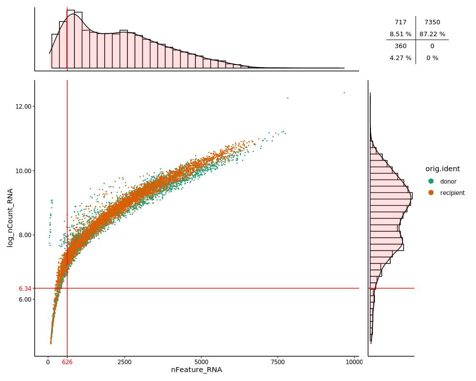

This is the figure, colored by cell type :


```{.r .fold-hide}
patchwork::wrap_plots(complete_p_scat(p_scat_cell_type), p_hist_1, p_hist_2, grobTable) +
  patchwork::plot_layout(design = "
                         BBBBBD\nAAAAAC\nAAAAAC\nAAAAAC",
                         guides = "collect",
                         widths = c(5,3),
                         heights = c(3,5)) +
  ggplot2::theme(panel.spacing = unit(15, "pt"),
                 legend.position = "right") &
  ggplot2::guides(color = guide_legend(ncol = 1, override.aes = list(size = 3)))
```

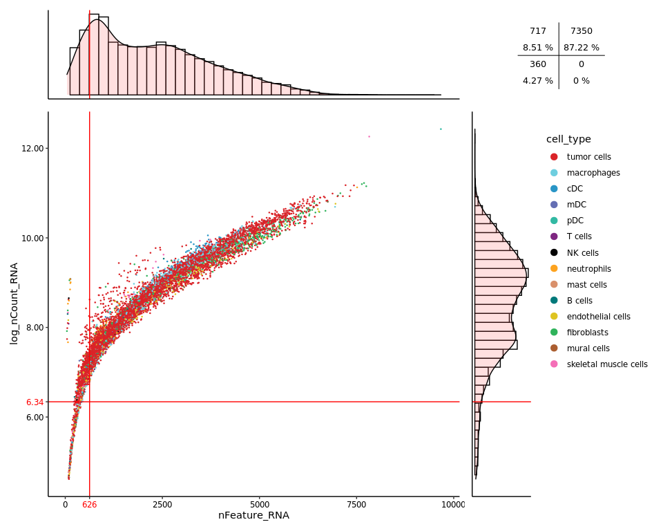

This is the figure, colored by the percentage of mitochondrial genes expressed in cell :


```{.r .fold-hide}
patchwork::wrap_plots(complete_p_scat(p_scat_mito), p_hist_1, p_hist_2, grobTable) +
  patchwork::plot_layout(design = "
                         BBBBBD\nAAAAAC\nAAAAAC\nAAAAAC",
                         guides = "collect",
                         widths = c(5,3),
                         heights = c(3,5)) +
  ggplot2::theme(panel.spacing = unit(15, "pt"),
                 legend.position = "right") &
  ggplot2::guides(color = guide_legend(ncol = 1, override.aes = list(size = 3)))
```

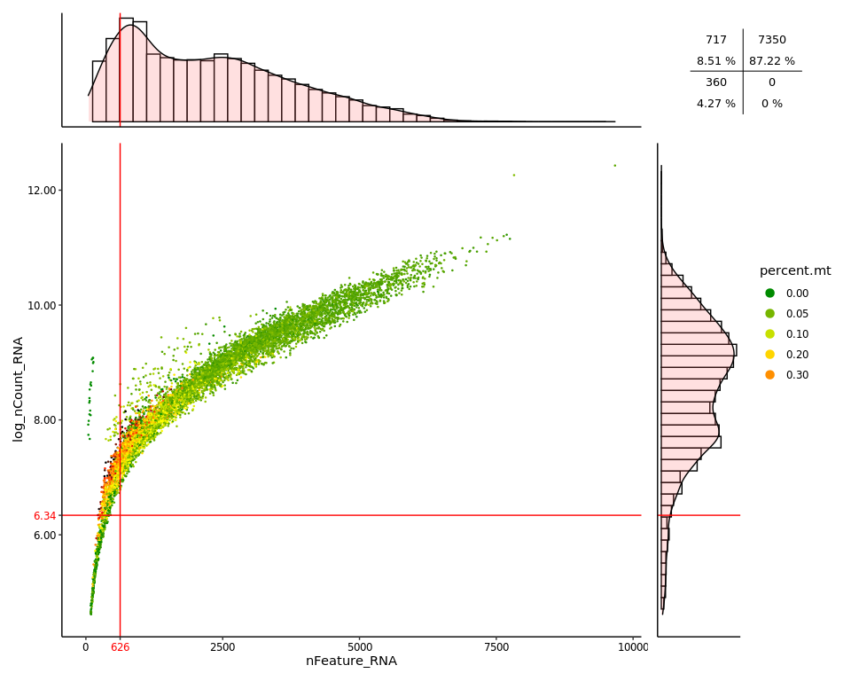

This is the figure, colored by the percentage of ribosomal genes expressed in cell :


```{.r .fold-hide}
patchwork::wrap_plots(complete_p_scat(p_scat_ribo), p_hist_1, p_hist_2, grobTable) +
  patchwork::plot_layout(design = "
                         BBBBBD\nAAAAAC\nAAAAAC\nAAAAAC",
                         guides = "collect",
                         widths = c(5,3),
                         heights = c(3,5)) +
  ggplot2::theme(panel.spacing = unit(15, "pt"),
                 legend.position = "right") &
  ggplot2::guides(color = guide_legend(ncol = 1, override.aes = list(size = 3)))
```

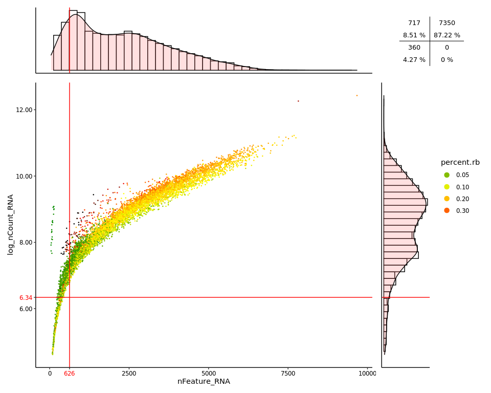

This is the figure, colored by the doublet cells status (`doublets_consensus.class`) :


```{.r .fold-hide}
patchwork::wrap_plots(complete_p_scat(p_scat_doublet_both), p_hist_1, p_hist_2, grobTable) +
  patchwork::plot_layout(design = "
                         BBBBBD\nAAAAAC\nAAAAAC\nAAAAAC",
                         guides = "collect",
                         widths = c(5,3),
                         heights = c(3,5)) +
  ggplot2::theme(panel.spacing = unit(15, "pt"),
                 legend.position = "right") &
  ggplot2::guides(color = guide_legend(ncol = 1, override.aes = list(size = 3)))
```

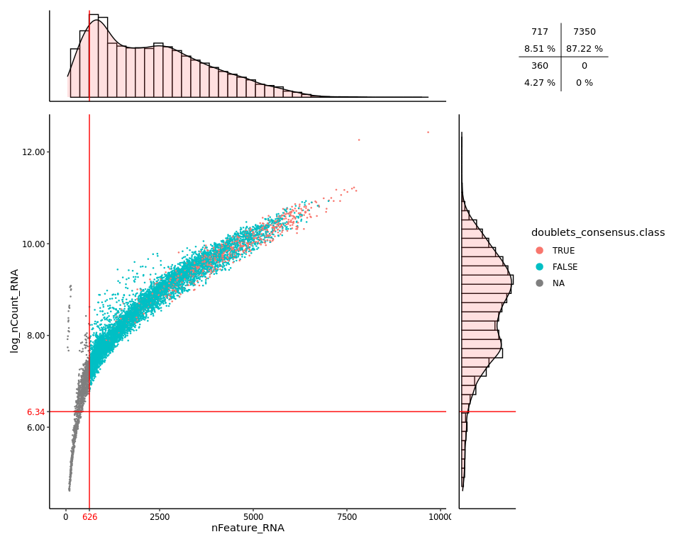

This is the figure, colored by the doublet cells status (`scDblFinder.class`) :


```{.r .fold-hide}
patchwork::wrap_plots(complete_p_scat(p_scat_scdblfinder), p_hist_1, p_hist_2, grobTable) +
  patchwork::plot_layout(design = "
                         BBBBBD\nAAAAAC\nAAAAAC\nAAAAAC",
                         guides = "collect",
                         widths = c(5,3),
                         heights = c(3,5)) +
  ggplot2::theme(panel.spacing = unit(15, "pt"),
                 legend.position = "right") &
  ggplot2::guides(color = guide_legend(ncol = 1, override.aes = list(size = 3)))
```

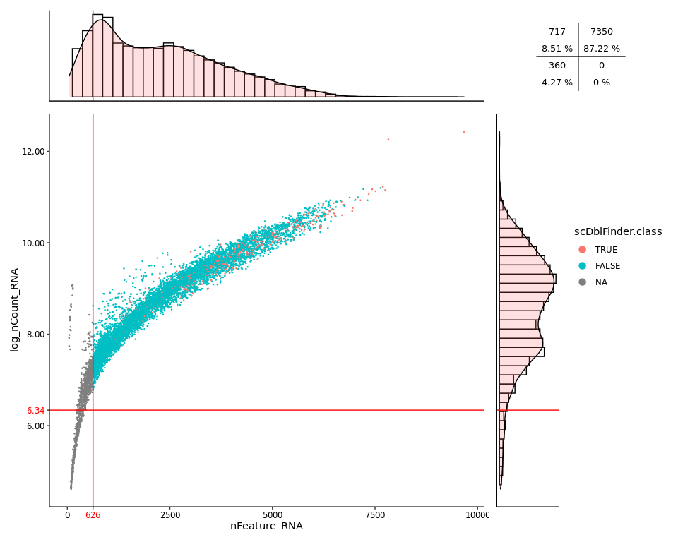

This is the figure, colored by the doublet cells status (`hybrid_score.class`) :


```{.r .fold-hide}
patchwork::wrap_plots(complete_p_scat(p_scat_hybrid), p_hist_1, p_hist_2, grobTable) +
  patchwork::plot_layout(design = "
                         BBBBBD\nAAAAAC\nAAAAAC\nAAAAAC",
                         guides = "collect",
                         widths = c(5,3),
                         heights = c(3,5)) +
  ggplot2::theme(panel.spacing = unit(15, "pt"),
                 legend.position = "right") &
  ggplot2::guides(color = guide_legend(ncol = 1, override.aes = list(size = 3)))
```

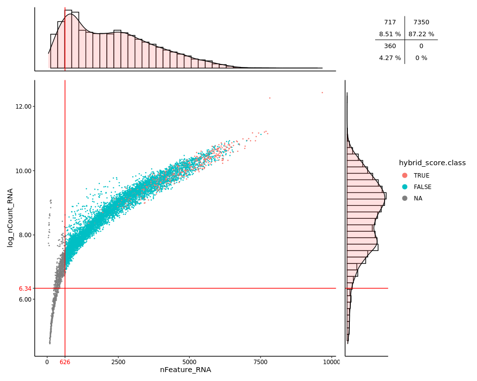


### Piecharts

Do filtered cells belong to a particular cell type ?


```{.r .fold-hide}
piechart_all_cells = aquarius::plot_piechart(df = sobj@meta.data,
                                             logical_var = "all_cells",
                                             grouping_var = "cell_type",
                                             colors = color_markers,
                                             display_legend = TRUE) +
  ggplot2::labs(title = "All cells",
                subtitle = paste(nrow(sobj@meta.data), "cells")) +
  ggplot2::theme(plot.title = element_text(hjust = 0.5, face = "bold"),
                 plot.subtitle = element_text(hjust = 0.5))

piechart_doublets = aquarius::plot_piechart(df = sobj@meta.data %>%
                                              dplyr::filter(doublets_consensus.class),
                                            logical_var = "all_cells",
                                            grouping_var = "cell_type",
                                            colors = color_markers,
                                            display_legend = TRUE) +
  ggplot2::labs(title = "doublets_consensus.class",
                subtitle = paste(sum(sobj$doublets_consensus.class, na.rm = TRUE), "cells")) +
  ggplot2::theme(plot.title = element_text(hjust = 0.5, face = "bold"),
                 plot.subtitle = element_text(hjust = 0.5))

piechart_percent.mt = aquarius::plot_piechart(df = sobj@meta.data %>%
                                                dplyr::filter(percent.mt > cut_percent.mt),
                                              logical_var = "all_cells",
                                              grouping_var = "cell_type",
                                              colors = color_markers,
                                              display_legend = TRUE) +
  ggplot2::labs(title = paste("percent.mt >", cut_percent.mt),
                subtitle = paste(length(fail_percent.mt), "cells")) +
  ggplot2::theme(plot.title = element_text(hjust = 0.5, face = "bold"),
                 plot.subtitle = element_text(hjust = 0.5))

piechart_percent.rb = aquarius::plot_piechart(df = sobj@meta.data %>%
                                                dplyr::filter(percent.rb > cut_percent.rb),
                                              logical_var = "all_cells",
                                              grouping_var = "cell_type",
                                              colors = color_markers,
                                              display_legend = TRUE) +
  ggplot2::labs(title = paste("percent.rb >", cut_percent.rb),
                subtitle = paste(length(fail_percent.rb), "cells")) +
  ggplot2::theme(plot.title = element_text(hjust = 0.5, face = "bold"),
                 plot.subtitle = element_text(hjust = 0.5))

piechart_log_nCount_RNA = aquarius::plot_piechart(df = sobj@meta.data %>%
                                                    dplyr::filter(log_nCount_RNA < cut_log_nCount_RNA),
                                                  logical_var = "all_cells",
                                                  grouping_var = "cell_type",
                                                  colors = color_markers,
                                                  display_legend = TRUE) +
  ggplot2::labs(title = paste("log_nCount_RNA <", round(cut_log_nCount_RNA, 2)),
                subtitle = paste(length(fail_log_nCount_RNA), "cells")) +
  ggplot2::theme(plot.title = element_text(hjust = 0.5, face = "bold"),
                 plot.subtitle = element_text(hjust = 0.5))

piechart_nFeature_RNA = aquarius::plot_piechart(df = sobj@meta.data %>%
                                                  dplyr::filter(nFeature_RNA < cut_nFeature_RNA),
                                                logical_var = "all_cells",
                                                grouping_var = "cell_type",
                                                colors = color_markers,
                                                display_legend = TRUE) +
  ggplot2::labs(title = paste("nFeature_RNA <", round(cut_nFeature_RNA, 2)),
                subtitle = paste(length(fail_nFeature_RNA), "cells")) +
  ggplot2::theme(plot.title = element_text(hjust = 0.5, face = "bold"),
                 plot.subtitle = element_text(hjust = 0.5))

patchwork::wrap_plots(piechart_all_cells, piechart_percent.mt, piechart_percent.rb,
                      piechart_doublets, piechart_nFeature_RNA, piechart_log_nCount_RNA) +
  patchwork::plot_layout(guides = "collect") &
  ggplot2::theme(legend.position = "right")
```

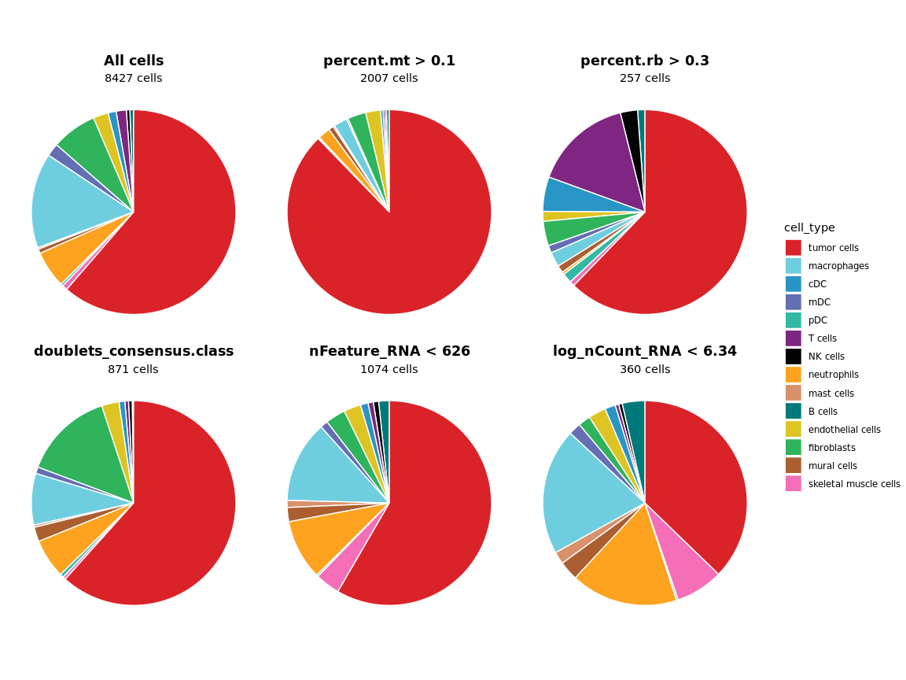

Do filtered cells belong to a particular sample ?


```{.r .fold-hide}
piechart_all_cells = aquarius::plot_piechart(df = sobj@meta.data,
                                             logical_var = "all_cells",
                                             grouping_var = "orig.ident",
                                             colors = sample_info$color,
                                             display_legend = TRUE) +
  ggplot2::scale_fill_manual(values = sample_info$color,
                             breaks = sample_info$sample_identifiant,
                             name = "Sample of origin") +
  ggplot2::labs(title = "All cells",
                subtitle = paste(nrow(sobj@meta.data), "cells")) +
  ggplot2::theme(plot.title = element_text(hjust = 0.5, face = "bold"),
                 plot.subtitle = element_text(hjust = 0.5))

piechart_percent.mt = aquarius::plot_piechart(df = sobj@meta.data %>%
                                                dplyr::filter(percent.mt > cut_percent.mt),
                                              logical_var = "all_cells",
                                              grouping_var = "orig.ident",
                                              colors = sample_info$color,
                                              display_legend = TRUE) +
  ggplot2::scale_fill_manual(values = sample_info$color,
                             breaks = sample_info$sample_identifiant,
                             name = "Sample of origin") +
  ggplot2::labs(title = paste("percent.mt >", cut_percent.mt),
                subtitle = paste(length(fail_percent.mt), "cells")) +
  ggplot2::theme(plot.title = element_text(hjust = 0.5, face = "bold"),
                 plot.subtitle = element_text(hjust = 0.5))

piechart_percent.rb = aquarius::plot_piechart(df = sobj@meta.data %>%
                                                dplyr::filter(percent.rb > cut_percent.rb),
                                              logical_var = "all_cells",
                                              grouping_var = "orig.ident",
                                              colors = sample_info$color,
                                              display_legend = TRUE) +
  ggplot2::scale_fill_manual(values = sample_info$color,
                             breaks = sample_info$sample_identifiant,
                             name = "Sample of origin") +
  ggplot2::labs(title = paste("percent.rb >", cut_percent.rb),
                subtitle = paste(length(fail_percent.rb), "cells")) +
  ggplot2::theme(plot.title = element_text(hjust = 0.5, face = "bold"),
                 plot.subtitle = element_text(hjust = 0.5))

piechart_log_nCount_RNA = aquarius::plot_piechart(df = sobj@meta.data %>%
                                                    dplyr::filter(log_nCount_RNA < cut_log_nCount_RNA),
                                                  logical_var = "all_cells",
                                                  grouping_var = "orig.ident",
                                                  colors = sample_info$color,
                                                  display_legend = TRUE) +
  ggplot2::scale_fill_manual(values = sample_info$color,
                             breaks = sample_info$sample_identifiant,
                             name = "Sample of origin") +
  ggplot2::labs(title = paste("log_nCount_RNA <", round(cut_log_nCount_RNA, 2)),
                subtitle = paste(length(fail_log_nCount_RNA), "cells")) +
  ggplot2::theme(plot.title = element_text(hjust = 0.5, face = "bold"),
                 plot.subtitle = element_text(hjust = 0.5))

piechart_nFeature_RNA = aquarius::plot_piechart(df = sobj@meta.data %>%
                                                  dplyr::filter(nFeature_RNA < cut_nFeature_RNA),
                                                logical_var = "all_cells",
                                                grouping_var = "orig.ident",
                                                colors = sample_info$color,
                                                display_legend = TRUE) +
  ggplot2::scale_fill_manual(values = sample_info$color,
                             breaks = sample_info$sample_identifiant,
                             name = "Sample of origin") +
  ggplot2::labs(title = paste("nFeature_RNA <", round(cut_nFeature_RNA, 2)),
                subtitle = paste(length(fail_nFeature_RNA), "cells")) +
  ggplot2::theme(plot.title = element_text(hjust = 0.5, face = "bold"),
                 plot.subtitle = element_text(hjust = 0.5))

piechart_doublets = aquarius::plot_piechart(df = sobj@meta.data %>%
                                              dplyr::filter(doublets_consensus.class),
                                            logical_var = "all_cells",
                                            grouping_var = "orig.ident",
                                            colors = sample_info$color,
                                            display_legend = TRUE) +
  ggplot2::scale_fill_manual(values = sample_info$color,
                             breaks = sample_info$sample_identifiant,
                             name = "Sample of origin") +
  ggplot2::labs(title = "doublets_consensus.class",
                subtitle = paste(sum(sobj$doublets_consensus.class, na.rm = TRUE), "cells")) +
  ggplot2::theme(plot.title = element_text(hjust = 0.5, face = "bold"),
                 plot.subtitle = element_text(hjust = 0.5))

patchwork::wrap_plots(piechart_all_cells, piechart_percent.mt, piechart_percent.rb,
                      piechart_doublets, piechart_nFeature_RNA, piechart_log_nCount_RNA) +
  patchwork::plot_layout(guides = "collect") &
  ggplot2::theme(legend.position = "right")
```

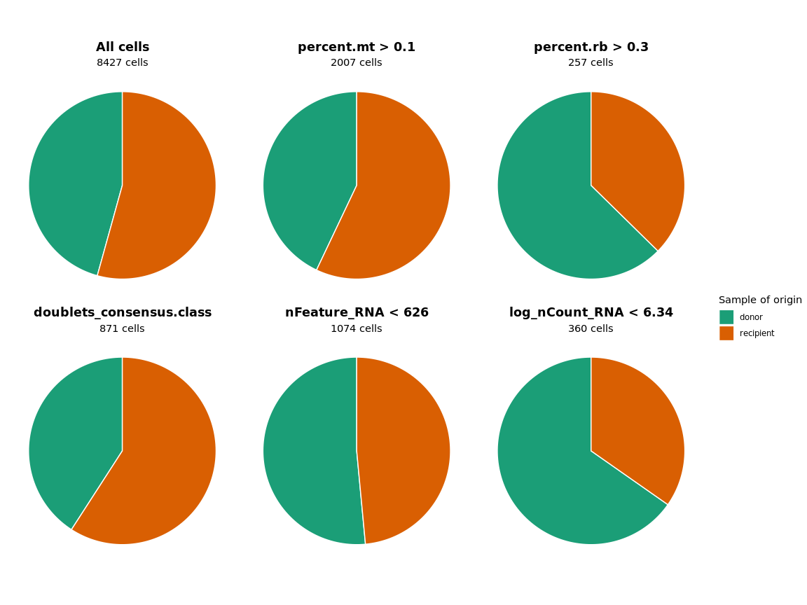


<p style="color:red;">Cells expressing a high level of mitochondrial genes are mainly tumor cells. We do not apply any filter based on this metric, to quantify cell type.</p> But, for trajectory inference, we will remove them.


# Filtering

We remove :

* cells with a number of UMI lower than 6.34
* cells expressing a number of genes lower than 626
* doublet cells detected with both method (**scDblFinder** and **scds-hybrid**)


```r
sobj = subset(sobj, invert = TRUE,
              cells = unique(c(fail_log_nCount_RNA, fail_nFeature_RNA, fail_doublets_consensus)))
sobj
```

```
## An object of class Seurat 
## 28000 features across 6482 samples within 1 assay 
## Active assay: RNA (28000 features, 3000 variable features)
```


We filter genes expressed in few cells :


```r
sobj = aquarius::filter_features(sobj, min_cells = 5)
sobj
```

We save this object and the metrics :


```r
saveRDS(sobj, paste0(out_dir, "/", save_name, "_sobj_filtered",
                     "_logCount_", round(cut_log_nCount_RNA, 2),
                     "_nFeature_", round(cut_nFeature_RNA, 2),
                     "_doublets_both.rds"))

save(fail_doublets_consensus, fail_doublets_scDblFinder, fail_doublets_hybrid,
     fail_percent.mt, fail_log_nCount_RNA, fail_nFeature_RNA,
     cut_percent.mt, cut_log_nCount_RNA, cut_nFeature_RNA,
     file = paste0(out_dir, "/", save_name, "_filtered_cells.rda"))
```


# Post-filtering processing

We normalize the count matrix for remaining cells :


```r
sobj = aquarius::sc_normalization(sobj = sobj,
                                  assay = "RNA",
                                  method = "LogNormalize",
                                  verbose = FALSE)
```


We perform a PCA :


```r
sobj = aquarius::dimensions_reduction(sobj = sobj,
                                      assay = "RNA",
                                      reduction = "pca",
                                      max_dims = 100,
                                      verbose = FALSE)
Seurat::ElbowPlot(sobj, ndims = 100, reduction = "RNA_pca")
```

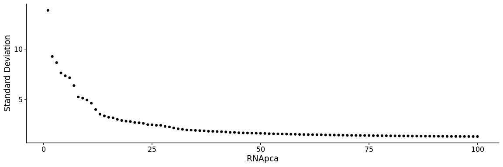


We generate a tSNE and a UMAP with 35 principal components :


```r
ndims = 35
sobj = Seurat::RunTSNE(sobj,
                       reduction = "RNA_pca",
                       dims = 1:ndims,
                       seed.use = 1337L,
                       reduction.name = paste0("RNA_pca_", ndims, "_tsne"))

sobj = Seurat::RunUMAP(sobj,
                       reduction = "RNA_pca",
                       dims = 1:ndims,
                       seed.use = 1337L,
                       reduction.name = paste0("RNA_pca_", ndims, "_umap"))
```


We can visualize the two representations. There is a batch effect :


```{.r .fold-hide}
tsne = Seurat::DimPlot(sobj, group.by = "orig.ident",
                       reduction = paste0("RNA_pca_", ndims, "_tsne"), cols = sample_info$color) +
  Seurat::NoAxes() + ggplot2::ggtitle("tSNE") +
  ggplot2::theme(aspect.ratio = 1,
                 plot.title = element_text(hjust = 0.5),
                 legend.position = "none")

umap = Seurat::DimPlot(sobj, group.by = "orig.ident",
                       reduction = paste0("RNA_pca_", ndims, "_umap"), cols = sample_info$color) +
  Seurat::NoAxes() + ggplot2::ggtitle("UMAP") +
  ggplot2::theme(aspect.ratio = 1,
                 plot.title = element_text(hjust = 0.5))

tsne | umap
```

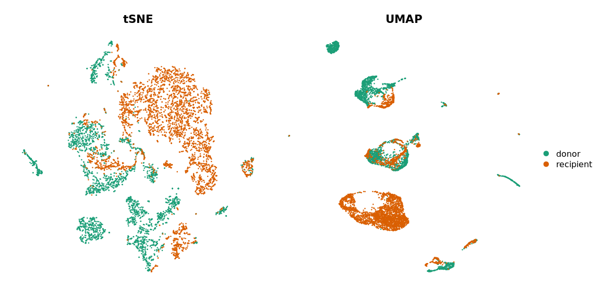


## Annotation

We annotate cells for cell type, with the new normalized expression matrix :


```{.r .fold-hide}
score_columns = grep(x = colnames(sobj@meta.data), pattern = "^score", value = TRUE)
sobj@meta.data[, score_columns] = NULL
sobj$cell_type = NULL

sobj = aquarius::cell_annot_custom(sobj,
                                   newname = "cell_type",
                                   markers = cell_markers,
                                   use_negative = TRUE,
                                   add_score = TRUE,
                                   verbose = TRUE)

sobj$cell_type = factor(sobj$cell_type, levels = cell_type_levels)

colnames(sobj@meta.data) = stringr::str_replace_all(string = colnames(sobj@meta.data),
                                                    pattern = " ",
                                                    replacement = "_")
```

(Time to run : 33.71 s)


To justify cell type annotation, we can make a dotplot :


```r
markers = unique(unlist(dotplot_markers[levels(sobj$cell_type)]))

aquarius::plot_dotplot(sobj, assay = "RNA",
                       column_name = "cell_type",
                       markers = c("Ptprc", markers, "dtTomato"),
                       nb_hline = 0) +
  ggplot2::scale_color_gradientn(colors = c("lightgray", "#FDBB84", "#EF6548", "#7F0000", "black")) +
  ggplot2::labs(x = "Cell type", y = "") +
  ggplot2::theme(legend.position = "right",
                 legend.box = "vertical",
                 legend.direction = "vertical") +
  ggplot2::geom_vline(xintercept = 0.5 + c(8, 12, 16, 17, 20, 23, 26, 29,
                                           33, 36, 38, 41, 43, 46, 47),
                      color = "gray92")
```

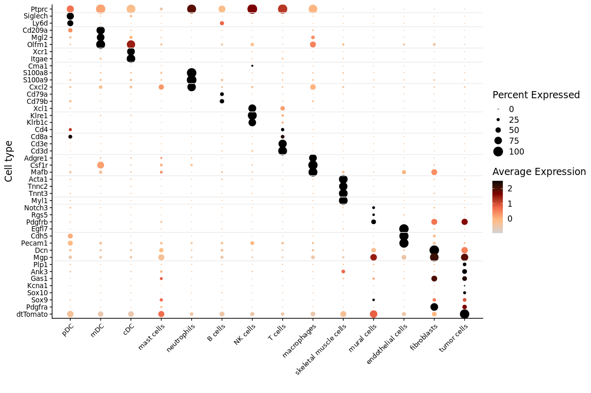


We can make a barplot to see the composition of each dataset.


```r
df_proportion = as.data.frame(prop.table(table(sobj$orig.ident,
                                               sobj$cell_type)))
colnames(df_proportion) = c("orig.ident", "cell_type", "freq")

quantif = table(sobj$orig.ident) %>%
  as.data.frame.table() %>%
  `colnames<-`(c("orig.ident", "nb_cells"))

aquarius::plot_barplot(df = df_proportion,
                       x = "orig.ident",
                       y = "freq",
                       fill = "cell_type",
                       position = ggplot2::position_fill()) +
  ggplot2::scale_fill_manual(name = "Cell type",
                             values = color_markers[levels(df_proportion$cell_type)],
                             breaks = levels(df_proportion$cell_type)) +
  ggplot2::geom_label(data = quantif, inherit.aes = FALSE,
                      aes(x = orig.ident, y = 1.05, label = nb_cells),
                      label.size = 0)
```

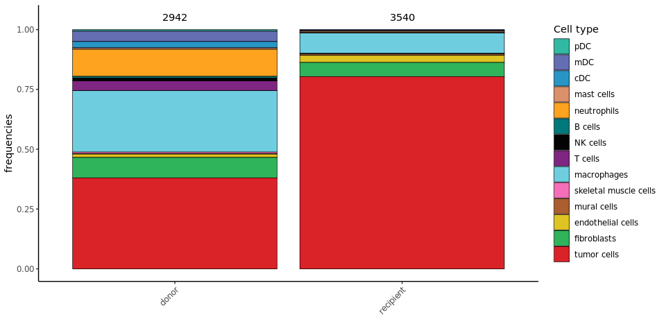


We annotate cells for cell cycle phase :


```r
cc_columns = aquarius::add_cell_cycle(sobj = sobj,
                                      assay = "RNA",
                                      species_rdx = "mm",
                                      BPPARAM = cl)@meta.data[, c("Seurat.Phase", "Phase")]
```

```
## 
##   G1  G2M    S 
## 6174  290   18
```

```r
sobj$Seurat.Phase = cc_columns$Seurat.Phase
sobj$cyclone.Phase = cc_columns$Phase
```

(Time to run : 176.94 s)


## Visualization

We can visualize the cell type :


```{.r .fold-hide}
tsne = Seurat::DimPlot(sobj, group.by = "cell_type",
                       reduction = paste0("RNA_pca_", ndims, "_tsne"), cols = color_markers) +
  Seurat::NoAxes() + ggplot2::ggtitle("tSNE") +
  ggplot2::theme(aspect.ratio = 1,
                 plot.title = element_text(hjust = 0.5),
                 legend.position = "none")

umap = Seurat::DimPlot(sobj, group.by = "cell_type",
                       reduction = paste0("RNA_pca_", ndims, "_umap"), cols = color_markers) +
  Seurat::NoAxes() + ggplot2::ggtitle("UMAP") +
  ggplot2::theme(aspect.ratio = 1,
                 plot.title = element_text(hjust = 0.5))

tsne | umap
```

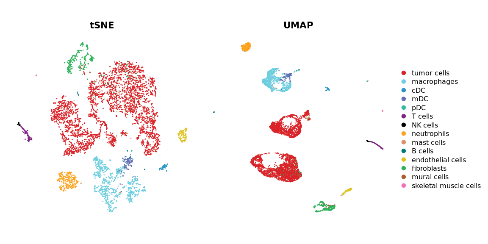


We can visualize the cell cycle, from Seurat :


```{.r .fold-hide}
tsne = Seurat::DimPlot(sobj, group.by = "Seurat.Phase",
                       reduction = paste0("RNA_pca_", ndims, "_tsne")) +
  Seurat::NoAxes() + ggplot2::ggtitle("tSNE") +
  ggplot2::theme(aspect.ratio = 1,
                 plot.title = element_text(hjust = 0.5),
                 legend.position = "none")

umap = Seurat::DimPlot(sobj, group.by = "Seurat.Phase",
                       reduction = paste0("RNA_pca_", ndims, "_umap")) +
  Seurat::NoAxes() + ggplot2::ggtitle("UMAP") +
  ggplot2::theme(aspect.ratio = 1,
                 plot.title = element_text(hjust = 0.5))

tsne | umap
```

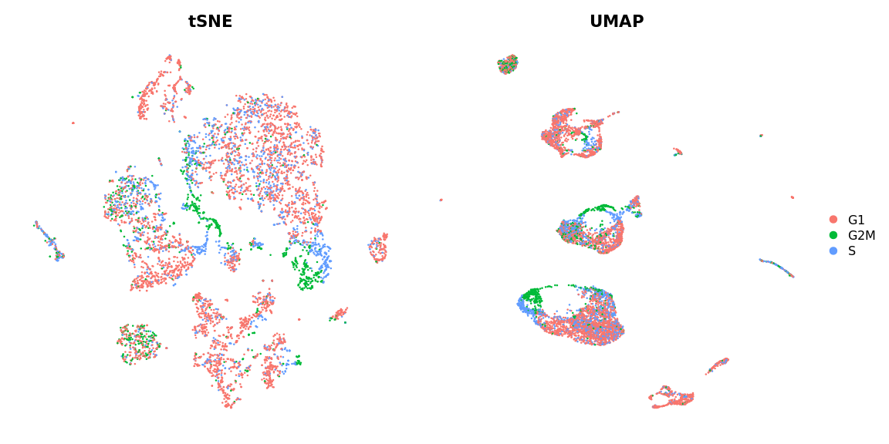


We can visualize the cell cycle, from cyclone :


```{.r .fold-hide}
tsne = Seurat::DimPlot(sobj, group.by = "cyclone.Phase",
                       reduction = paste0("RNA_pca_", ndims, "_tsne")) +
  Seurat::NoAxes() + ggplot2::ggtitle("tSNE") +
  ggplot2::theme(aspect.ratio = 1,
                 plot.title = element_text(hjust = 0.5),
                 legend.position = "none")

umap = Seurat::DimPlot(sobj, group.by = "cyclone.Phase",
                       reduction = paste0("RNA_pca_", ndims, "_umap")) +
  Seurat::NoAxes() + ggplot2::ggtitle("UMAP") +
  ggplot2::theme(aspect.ratio = 1,
                 plot.title = element_text(hjust = 0.5))

tsne | umap
```

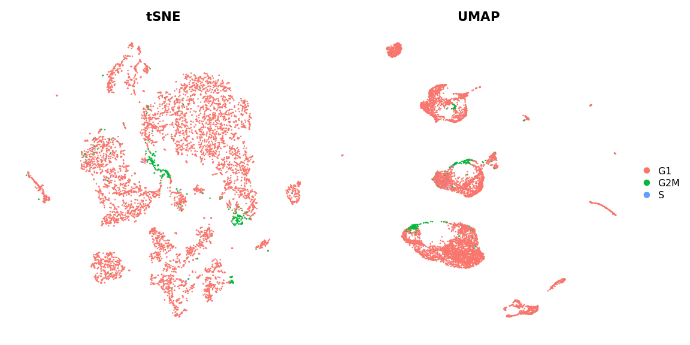


## Save

We save the annotated and filtered Seurat object :


```r
saveRDS(sobj, file = paste0(out_dir, "/", save_name, "_sobj_filtered_processed.rds"))
```


# Batch effect removal with harmony

On the previous Seurat object, we generate a reduction without batch-effect, from the PCA.


```r
`%||%` = function(lhs, rhs) {
  if (!is.null(x = lhs)) {
    return(lhs)
  } else {
    return(rhs)
  }
}

set.seed(1337L)
sobj = harmony::RunHarmony(object = sobj,
                           group.by.vars = "orig.ident",
                           plot_convergence = TRUE,
                           reduction = "RNA_pca",
                           assay.use = "RNA",
                           reduction.save = "harmony",
                           max.iter.harmony = 20,
                           project.dim = FALSE)
```

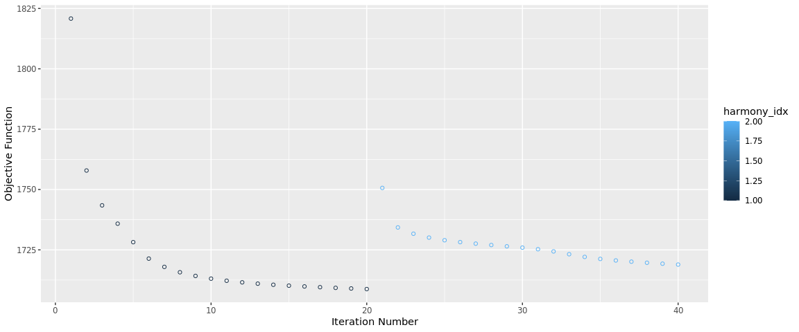(Time to run : 8.16 s)

From this batch-effect removed projection, we generate several tSNE and UMAP.


```r
dims_vector = c(10, 20, 30, 35, 40, 50)
for (ndims in dims_vector) {
  sobj = Seurat::RunUMAP(sobj,
                         dims = 1:ndims,
                         reduction = "harmony",
                         reduction.name = paste0("harmony_", ndims, "_umap"),
                         reduction.key = paste0("harmony", ndims, "umap_"))
  sobj = Seurat::RunTSNE(sobj,
                         dims = 1:ndims,
                         seed.use = 1337L,
                         reduction = "harmony",
                         reduction.name = paste0("harmony_", ndims, "_tsne"),
                         reduction.key = paste0("harmony", ndims, "tsne_"))
}
```

We can visualize these representations :


```{.r .fold-hide}
# tsne - orig.ident
plot_list = lapply(dims_vector, FUN = function(ndims) {
  Seurat::DimPlot(sobj, group.by = "orig.ident",
                  reduction = paste0("harmony_", ndims, "_tsne")) +
    ggplot2::scale_color_manual(values = sample_info$color,
                                breaks = sample_info$sample_identifiant,
                                name = "Sample of origin") +
    ggplot2::ggtitle(paste0("harmony_", ndims, "_tsne"))})
# tsne - cell_type
plot_list = c(plot_list,
              lapply(dims_vector, FUN = function(ndims) {
                Seurat::DimPlot(sobj, group.by = "cell_type",
                                reduction = paste0("harmony_", ndims, "_tsne")) +
                  ggplot2::scale_color_manual(values = color_markers,
                                              breaks = names(color_markers),
                                              name = "Cell type") +
                  ggplot2::ggtitle(paste0("harmony_", ndims, "_tsne"))}))
# tsne - Seurat.Phase
plot_list = c(plot_list,
              lapply(dims_vector, FUN = function(ndims) {
                Seurat::DimPlot(sobj, group.by = "cyclone.Phase",
                                reduction = paste0("harmony_", ndims, "_tsne")) +
                  ggplot2::scale_color_manual(values = aquarius::gg_color_hue(3),
                                              breaks = c("G1", "G2M", "S"),
                                              name = "Cell cycle") +
                  ggplot2::ggtitle(paste0("harmony_", ndims, "_tsne"))}))
# umap - orig.ident
plot_list = c(plot_list,
              lapply(dims_vector, FUN = function(ndims) {
                Seurat::DimPlot(sobj, group.by = "orig.ident",
                                reduction = paste0("harmony_", ndims, "_umap")) +
                  ggplot2::scale_color_manual(values = sample_info$color,
                                              breaks = sample_info$sample_identifiant,
                                              name = "Sample of origin") +
                  ggplot2::ggtitle(paste0("harmony_", ndims, "_umap"))}))
# umap - cell_type
plot_list = c(plot_list,
              lapply(dims_vector, FUN = function(ndims) {
                Seurat::DimPlot(sobj, group.by = "cell_type",
                                reduction = paste0("harmony_", ndims, "_umap")) +
                  ggplot2::scale_color_manual(values = color_markers,
                                              breaks = names(color_markers),
                                              name = "Cell type") +
                  ggplot2::ggtitle(paste0("harmony_", ndims, "_umap"))
              }))
# umap - Seurat.Phase
plot_list = c(plot_list,
              lapply(dims_vector, FUN = function(ndims) {
                Seurat::DimPlot(sobj, group.by = "cyclone.Phase",
                                reduction = paste0("harmony_", ndims, "_umap")) +
                  ggplot2::scale_color_manual(values = aquarius::gg_color_hue(3),
                                              breaks = c("G1", "G2M", "S"),
                                              name = "Cell cycle") +
                  ggplot2::ggtitle(paste0("harmony_", ndims, "_umap"))}))

# Common theme
plot_list = lapply(plot_list, FUN = function(one_plot) {
  one_plot +
    Seurat::NoAxes() +
    ggplot2::theme(aspect.ratio = 1,
                   plot.title = element_text(hjust = 0.5),
                   legend.title = element_text(face = "bold"))
})

# Change order
# current order : all tsne sample - all tsne cell type - all tsne cell cycle - same for umap
# wanted order : for each dim : tsne sample - tsne cell type - tsne cell cycle, same for umap
names(plot_list) = c(1:length(plot_list))
plot_order = lapply(c(0:(length(dims_vector) - 1)), FUN = function(id) {
  tsne = c(1, 1 + length(dims_vector), 1 + 2*length(dims_vector)) + id
  umap = c(1, 1 + length(dims_vector), 1 + 2*length(dims_vector)) + id + length(dims_vector)*3
  return(c(tsne, umap))
}) %>% unlist()
plot_list = plot_list[plot_order]
rm(plot_order)
```


```r
patchwork::wrap_plots(plot_list, ncol = 3) +
  patchwork::plot_layout(guides = "collect") & 
  ggplot2::theme(legend.position = "right",
                 legend.direction = "vertical",
                 legend.box = "vertical")
```

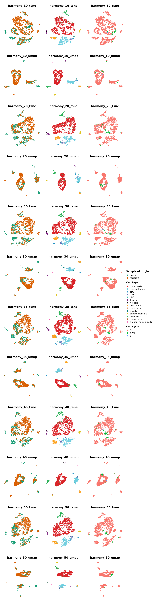


We save the annotated, filtered and batch-effect removed Seurat object :


```r
saveRDS(sobj, file = paste0(out_dir, "/", save_name, "_sobj_filtered_processed_harmony.rds"))
```


# R session

<details><summary>show</summary>

```
## R version 3.6.3 (2020-02-29)
## Platform: x86_64-pc-linux-gnu (64-bit)
## Running under: Ubuntu 20.04.5 LTS
## 
## Matrix products: default
## BLAS:   /usr/local/lib/R/lib/libRblas.so
## LAPACK: /usr/local/lib/R/lib/libRlapack.so
## 
## locale:
## [1] C
## 
## attached base packages:
## [1] stats     graphics  grDevices utils     datasets  methods   base     
## 
## other attached packages:
## [1] patchwork_1.0.1.9000 ggplot2_3.3.5        dplyr_1.0.7         
## 
## loaded via a namespace (and not attached):
##   [1] softImpute_1.4              graphlayouts_0.7.0         
##   [3] pbapply_1.4-2               lattice_0.20-41            
##   [5] haven_2.3.1                 vctrs_0.3.8                
##   [7] usethis_2.0.1               dynwrap_1.2.1              
##   [9] blob_1.2.1                  survival_3.2-13            
##  [11] prodlim_2019.11.13          dynutils_1.0.5.9000        
##  [13] DBI_1.1.1                   R.utils_2.11.0             
##  [15] SingleCellExperiment_1.8.0  rappdirs_0.3.3             
##  [17] uwot_0.1.8                  dqrng_0.2.1                
##  [19] jpeg_0.1-8.1                zlibbioc_1.32.0            
##  [21] pspline_1.0-18              pcaMethods_1.78.0          
##  [23] mvtnorm_1.1-1               htmlwidgets_1.5.4          
##  [25] GlobalOptions_0.1.2         future_1.22.1              
##  [27] UpSetR_1.4.0                laeken_0.5.2               
##  [29] leiden_0.3.3                clustree_0.4.3             
##  [31] parallel_3.6.3              scater_1.14.6              
##  [33] irlba_2.3.3                 DEoptimR_1.0-9             
##  [35] tidygraph_1.1.2             Rcpp_1.0.9                 
##  [37] readr_2.0.2                 KernSmooth_2.23-17         
##  [39] carrier_0.1.0               gdata_2.18.0               
##  [41] DelayedArray_0.12.3         limma_3.42.2               
##  [43] RcppParallel_5.1.4          Hmisc_4.4-0                
##  [45] fs_1.5.2                    RSpectra_0.16-0            
##  [47] fastmatch_1.1-0             ranger_0.12.1              
##  [49] digest_0.6.25               png_0.1-7                  
##  [51] sctransform_0.2.1           cowplot_1.0.0              
##  [53] DOSE_3.12.0                 ggvenn_0.1.9               
##  [55] TInGa_0.0.0.9000            ggraph_2.0.3               
##  [57] pkgconfig_2.0.3             GO.db_3.10.0               
##  [59] DelayedMatrixStats_1.8.0    gower_0.2.1                
##  [61] ggbeeswarm_0.6.0            iterators_1.0.12           
##  [63] DropletUtils_1.6.1          reticulate_1.26            
##  [65] clusterProfiler_3.14.3      SummarizedExperiment_1.16.1
##  [67] circlize_0.4.16             beeswarm_0.4.0             
##  [69] GetoptLong_1.0.5            xfun_0.35                  
##  [71] bslib_0.3.1                 zoo_1.8-10                 
##  [73] tidyselect_1.1.0            reshape2_1.4.4             
##  [75] purrr_0.3.4                 ica_1.0-2                  
##  [77] pcaPP_1.9-73                viridisLite_0.3.0          
##  [79] rtracklayer_1.46.0          rlang_1.0.2                
##  [81] hexbin_1.28.1               jquerylib_0.1.4            
##  [83] dyneval_0.9.9               glue_1.4.2                 
##  [85] RColorBrewer_1.1-2          matrixStats_0.56.0         
##  [87] stringr_1.4.0               lava_1.6.7                 
##  [89] europepmc_0.3               DESeq2_1.26.0              
##  [91] recipes_0.1.17              labeling_0.3               
##  [93] harmony_0.1.0               class_7.3-17               
##  [95] BiocNeighbors_1.4.2         DO.db_2.9                  
##  [97] annotate_1.64.0             jsonlite_1.7.2             
##  [99] XVector_0.26.0              bit_4.0.4                  
## [101] aquarius_0.1.3              gridExtra_2.3              
## [103] gplots_3.0.3                Rsamtools_2.2.3            
## [105] stringi_1.4.6               processx_3.5.2             
## [107] gsl_2.1-6                   bitops_1.0-6               
## [109] cli_3.0.1                   batchelor_1.2.4            
## [111] RSQLite_2.2.0               randomForest_4.6-14        
## [113] tidyr_1.1.4                 data.table_1.14.2          
## [115] rstudioapi_0.13             org.Mm.eg.db_3.10.0        
## [117] GenomicAlignments_1.22.1    nlme_3.1-147               
## [119] qvalue_2.18.0               scran_1.14.6               
## [121] locfit_1.5-9.4              scDblFinder_1.1.8          
## [123] listenv_0.8.0               ggthemes_4.2.4             
## [125] gridGraphics_0.5-0          R.oo_1.24.0                
## [127] dbplyr_1.4.4                BiocGenerics_0.32.0        
## [129] TTR_0.24.2                  readxl_1.3.1               
## [131] lifecycle_1.0.1             timeDate_3043.102          
## [133] ggpattern_0.3.1             munsell_0.5.0              
## [135] cellranger_1.1.0            R.methodsS3_1.8.1          
## [137] proxyC_0.1.5                visNetwork_2.0.9           
## [139] caTools_1.18.0              codetools_0.2-16           
## [141] Biobase_2.46.0              GenomeInfoDb_1.22.1        
## [143] vipor_0.4.5                 lmtest_0.9-38              
## [145] htmlTable_1.13.3            triebeard_0.3.0            
## [147] lsei_1.2-0                  xtable_1.8-4               
## [149] ROCR_1.0-7                  BiocManager_1.30.10        
## [151] scatterplot3d_0.3-41        abind_1.4-5                
## [153] farver_2.0.3                parallelly_1.28.1          
## [155] RANN_2.6.1                  askpass_1.1                
## [157] GenomicRanges_1.38.0        RcppAnnoy_0.0.16           
## [159] tibble_3.1.5                ggdendro_0.1-20            
## [161] cluster_2.1.0               future.apply_1.5.0         
## [163] Seurat_3.1.5                dendextend_1.15.1          
## [165] Matrix_1.3-2                ellipsis_0.3.2             
## [167] prettyunits_1.1.1           lubridate_1.7.9            
## [169] ggridges_0.5.2              igraph_1.2.5               
## [171] RcppEigen_0.3.3.7.0         fgsea_1.12.0               
## [173] remotes_2.4.2               destiny_3.0.1              
## [175] scBFA_1.0.0                 VIM_6.1.1                  
## [177] testthat_3.1.0              htmltools_0.5.2            
## [179] BiocFileCache_1.10.2        yaml_2.2.1                 
## [181] utf8_1.1.4                  plotly_4.9.2.1             
## [183] XML_3.99-0.3                ModelMetrics_1.2.2.2       
## [185] e1071_1.7-3                 foreign_0.8-76             
## [187] withr_2.5.0                 fitdistrplus_1.0-14        
## [189] BiocParallel_1.20.1         xgboost_1.4.1.1            
## [191] bit64_4.0.5                 foreach_1.5.0              
## [193] robustbase_0.93-9           Biostrings_2.54.0          
## [195] GOSemSim_2.13.1             rsvd_1.0.3                 
## [197] memoise_2.0.0               evaluate_0.18              
## [199] forcats_0.5.0               rio_0.5.16                 
## [201] geneplotter_1.64.0          tzdb_0.1.2                 
## [203] caret_6.0-86                ps_1.6.0                   
## [205] curl_4.3                    DiagrammeR_1.0.6.1         
## [207] fdrtool_1.2.15              fansi_0.4.1                
## [209] highr_0.8                   urltools_1.7.3             
## [211] xts_0.12.1                  acepack_1.4.1              
## [213] edgeR_3.28.1                checkmate_2.0.0            
## [215] scds_1.2.0                  cachem_1.0.6               
## [217] npsurv_0.4-0                rjson_0.2.20               
## [219] openxlsx_4.1.5              ggrepel_0.9.1              
## [221] clue_0.3-60                 stabledist_0.7-1           
## [223] tools_3.6.3                 sass_0.4.0                 
## [225] nichenetr_0.1.0             magrittr_2.0.1             
## [227] RCurl_1.98-1.2              proxy_0.4-24               
## [229] car_3.0-11                  ape_5.3                    
## [231] ggplotify_0.0.5             xml2_1.3.2                 
## [233] httr_1.4.2                  assertthat_0.2.1           
## [235] rmarkdown_2.18              boot_1.3-25                
## [237] globals_0.14.0              R6_2.4.1                   
## [239] Rhdf5lib_1.8.0              nnet_7.3-14                
## [241] RcppHNSW_0.2.0              progress_1.2.2             
## [243] genefilter_1.68.0           statmod_1.4.34             
## [245] gtools_3.8.2                shape_1.4.6                
## [247] HDF5Array_1.14.4            BiocSingular_1.2.2         
## [249] rhdf5_2.30.1                splines_3.6.3              
## [251] carData_3.0-4               colorspace_1.4-1           
## [253] generics_0.1.0              stats4_3.6.3               
## [255] base64enc_0.1-3             dynfeature_1.0.0.9000      
## [257] smoother_1.1                gridtext_0.1.1             
## [259] pillar_1.6.3                tweenr_1.0.1               
## [261] sp_1.4-1                    ggplot.multistats_1.0.0    
## [263] rvcheck_0.1.8               GenomeInfoDbData_1.2.2     
## [265] plyr_1.8.6                  gtable_0.3.0               
## [267] zip_2.2.0                   knitr_1.41                 
## [269] ComplexHeatmap_2.13.1       latticeExtra_0.6-29        
## [271] biomaRt_2.42.1              IRanges_2.20.2             
## [273] fastmap_1.1.0               ADGofTest_0.3              
## [275] copula_1.0-0                doParallel_1.0.15          
## [277] AnnotationDbi_1.48.0        vcd_1.4-8                  
## [279] babelwhale_1.0.1            openssl_1.4.1              
## [281] scales_1.1.1                backports_1.2.1            
## [283] S4Vectors_0.24.4            ipred_0.9-12               
## [285] enrichplot_1.6.1            hms_1.1.1                  
## [287] ggforce_0.3.1               Rtsne_0.15                 
## [289] numDeriv_2016.8-1.1         polyclip_1.10-0            
## [291] grid_3.6.3                  lazyeval_0.2.2             
## [293] Formula_1.2-3               tsne_0.1-3                 
## [295] crayon_1.3.4                MASS_7.3-54                
## [297] pROC_1.16.2                 viridis_0.5.1              
## [299] dynparam_1.0.0              rpart_4.1-15               
## [301] compiler_3.6.3              ggtext_0.1.0               
## [303] zinbwave_1.8.0
```


</details>
