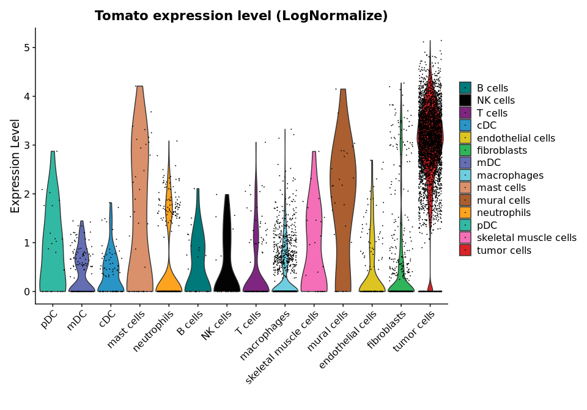
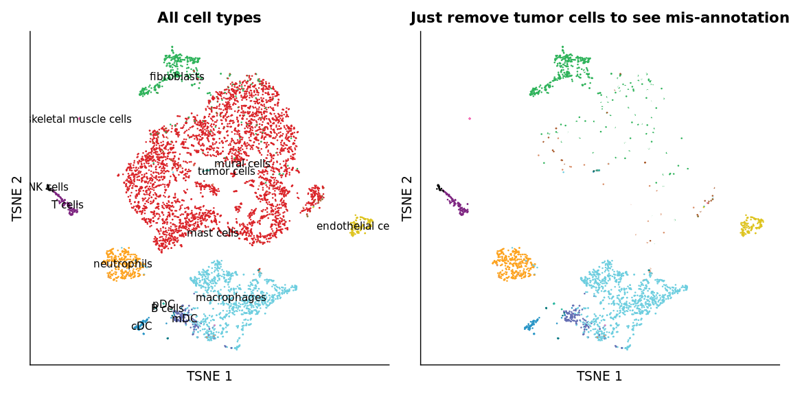
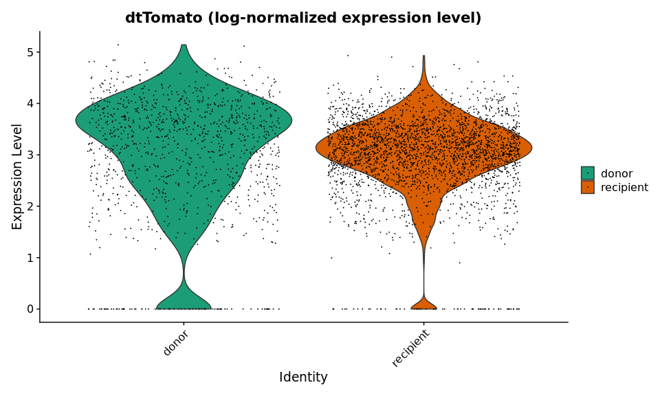
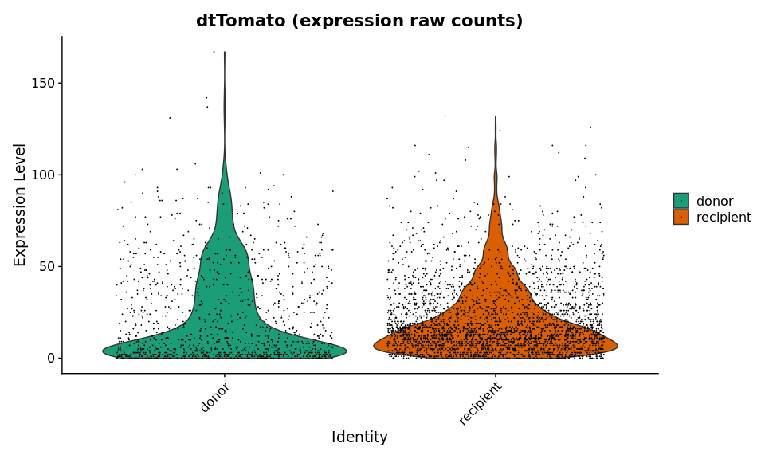
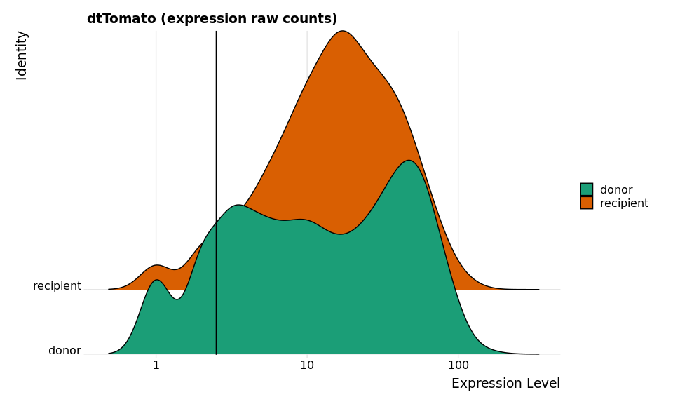
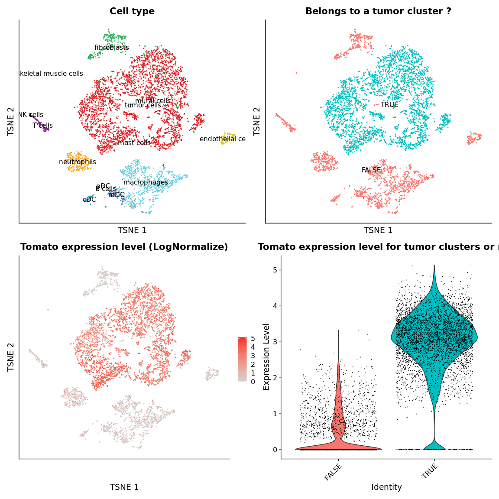
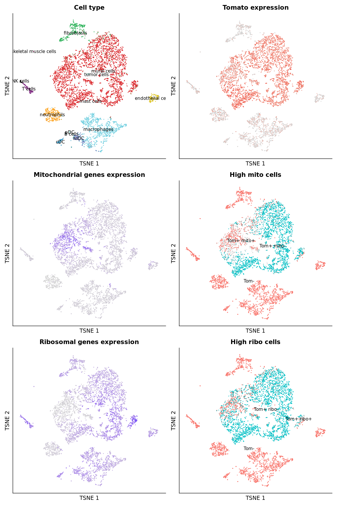
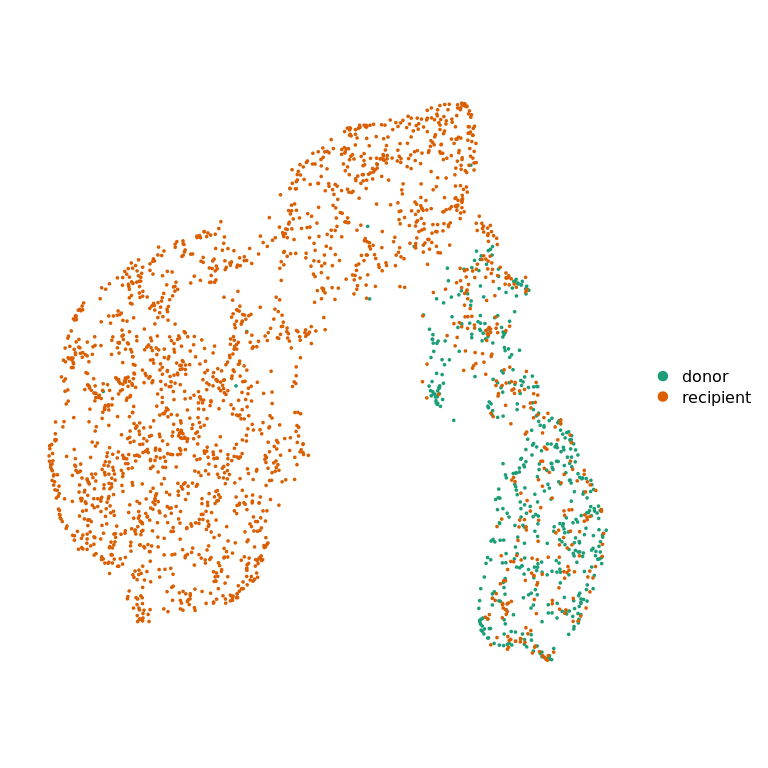
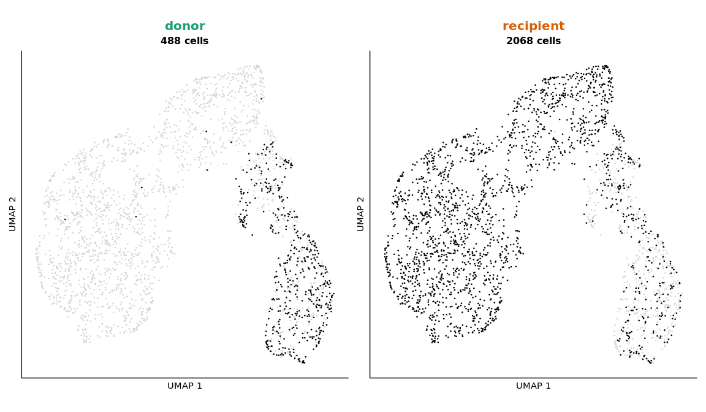
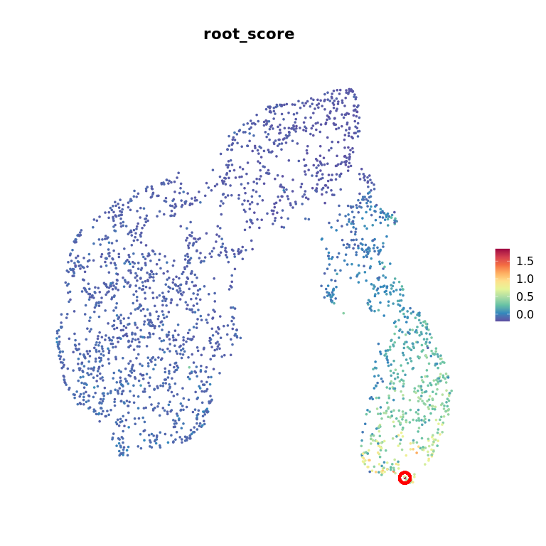

<style>
body {
text-align: justify}
</style>

<!-- Automatically computes and prints in the output the running time for any code chunk -->


<!-- Set default parameters for all chunks -->


This script is used to generate a tumor cells dataset from a combined Seurat object containing several datasets with all cell populations. It generates a 2D representation taking into account only the selected cells. To anticipate trajectory inference, it selects a root cell. The final object is saved. After running this file, one can :

* infer trajectory
* perform functional enrichment analysis


# Set environment


```r
library(patchwork)
library(ggplot2)
library(dplyr)
```

We load the parameters :


```r
out_dir = params$out_dir
```

We load the integrated Seurat object containing all filtered cells from all datasets :


```r
sample_name = "donor18_recipient23"

sobj = readRDS(paste0(out_dir, "/", sample_name, "_sobj_filtered_processed_harmony.rds"))
sobj
```

```
## An object of class Seurat 
## 17179 features across 6482 samples within 1 assay 
## Active assay: RNA (17179 features, 3000 variable features)
##  16 dimensional reductions calculated: RNA_pca, RNA_pca_35_tsne, RNA_pca_35_umap, harmony, harmony_10_umap, harmony_10_tsne, harmony_20_umap, harmony_20_tsne, harmony_30_umap, harmony_30_tsne, harmony_35_umap, harmony_35_tsne, harmony_40_umap, harmony_40_tsne, harmony_50_umap, harmony_50_tsne
```


We set all other variables for colors and annotation.


```r
# Samples colors
load(paste0(out_dir, "/", sample_name, "_sample_info.rda"))
sample_info$tumor_type = as.character(sample_info$tumor_type)
sample_info$project_name = as.character(sample_info$project_name)

# Cell types colors and markers
load(paste0(out_dir, "/color_markers.rda"))
```


# Extract only tumor cells

## How to extract only tumor cells ?

### Based on Tomato expression level ?

Based on Tomato expression, this is difficult. Below is a violin plot showing Tomato expression level in all cells, group by cell type. Cell type has been annotated using marker genes expression level, with our custom method. If we set a threshold for Tomato expression :

* if the threshold is too low, we will have a lot of **false positive cells** (with a Tomato background but not a tumor cell)
* if the threshold is too high, we will still have some false positive cells, but we will also miss a lot of true tumor cells (**false negative cells**)


```r
Seurat::VlnPlot(sobj, features = "dtTomato", group.by = "cell_type", pt.size = 0.01) +
  ggplot2::scale_fill_manual(values = color_markers[sort(names(color_markers))],
                             breaks = sort(names(color_markers))) +
  ggplot2::labs(title = "Tomato expression level (LogNormalize)",
                x = "")
```



This violin plot shows annotation mistakes for fibroblasts and skeletal muscle cells : they express Tomato. For mis-annotated skeletal muscle cells, this is because they express a high level of ribosomal genes. They won't be taken into account for trajectory inference, because we are going to apply a filtering based on ribosomal gene expression. When we look at scores for cell types, for those cells, they have low scores for all cell types, but skeletal muscle cells score is the less low, so they are annotated as this cell type. For fibroblasts, this is because there is an annotation competition between mesenchymal tumor cells (in MPNST) and fibroblasts. We could correct the annotation, but this concern few cells.


### Based on cell type annotation ?

We can visualize cell type annotation on a tSNE. On the right, we can visualize all cell populations. There is a mis-annotation for some cells that are overlapping with annotated tumor cells, but not annotated as non tumor cells. This may be due to a low expression level of some important genes in tumor cells classification. On the right, we can see those cells when we remove cells annotated as tumor cells.


```{.r .fold-hide}
color_markers2 = color_markers
color_markers2["tumor cells"] = "white" # just to remove tumor cells

with = Seurat::DimPlot(sobj, reduction = "harmony_35_tsne", label = TRUE,
                       group.by = "cell_type", cols = color_markers) +
  ggplot2::labs(x = "TSNE 1", y = "TSNE 2",
                title = "All cell types") +
  ggplot2::theme(axis.ticks = element_blank(),
                 axis.text = element_blank(),
                 plot.title = element_text(hjust = 0.5)) +
  Seurat::NoLegend()

without = Seurat::DimPlot(sobj, reduction = "harmony_35_tsne",
                          group.by = "cell_type", cols = color_markers2) +
  ggplot2::labs(x = "TSNE 1", y = "TSNE 2",
                title = "Just remove tumor cells to see mis-annotation") +
  ggplot2::theme(axis.ticks = element_blank(),
                 axis.text = element_blank(),
                 plot.title = element_text(hjust = 0.5)) +
  Seurat::NoLegend()

with | without
```




Moreover, what is the expression level of Tomato in cells annotated as tumor cells, for each sample ?


```r
subsobj = subset(sobj, cell_type == "tumor cells")
subsobj
```

```
## An object of class Seurat 
## 17179 features across 3963 samples within 1 assay 
## Active assay: RNA (17179 features, 3000 variable features)
##  16 dimensional reductions calculated: RNA_pca, RNA_pca_35_tsne, RNA_pca_35_umap, harmony, harmony_10_umap, harmony_10_tsne, harmony_20_umap, harmony_20_tsne, harmony_30_umap, harmony_30_tsne, harmony_35_umap, harmony_35_tsne, harmony_40_umap, harmony_40_tsne, harmony_50_umap, harmony_50_tsne
```


Below is Tomato **normalized expression level** in cells annotated as tumor cells, split by sample of origin :


```{.r .fold-hide}
Seurat::VlnPlot(subsobj, features = "dtTomato",
                pt.size = 0.001, group.by = "orig.ident", cols = sample_info$color) +
  ggplot2::labs(title = "dtTomato (log-normalized expression level)")
```



Below is Tomato **raw expression level** in cells annotated as tumor cells, split by sample of origin :


```{.r .fold-hide}
Seurat::VlnPlot(subsobj, features = "dtTomato", pt.size = 0.001, slot = "counts",
                group.by = "orig.ident", cols = sample_info$color) +
  ggplot2::labs(title = "dtTomato (expression raw counts)")
```




```r
tom_thresh = 2.5
```

It seems there is a strong background in, at least, sample *pNF_2*. This is a plexiform sample, and this is the only one with "a lot" of tumor cells. We can see the background with a RidgePlot and a log-scale. We set a threshold to `tom_thresh` for Tomato number of counts :

Below is the rigde plot :


```{.r .fold-hide}
Seurat::RidgePlot(subsobj, features = "dtTomato", slot = "counts", log = TRUE,
                  group.by = "orig.ident", cols = sample_info$color) +
  ggplot2::labs(title = "dtTomato (expression raw counts)") +
  ggplot2::geom_vline(xintercept = tom_thresh)
```




How many annotated tumor cells are Tomato negative in each sample ?


```r
subsobj$Tomato_expression = Seurat::GetAssayData(subsobj, assay = "RNA", slot = "counts")["dtTomato",]
table(subsobj$Tomato_expression >= tom_thresh, subsobj$orig.ident)
```

```
##        
##         donor recipient
##   FALSE   262       263
##   TRUE    856      2582
```


### Based on clustering ?

To overcome the mis-annotation problem, we can perform a non supervised highly resolutive clustering. This will define a lot of small clusters of cells sharing common features. The idea is to keep clusters containing more than 80 \% of tumor cells or having a high average expression level for Tomato. But, with this method, we may miss some tumor cells or add some non tumor cells that are closely related to true tumor cells, such as fibroblasts.

But, this highly resolutive clustering can gather cells mis-annotated as non tumor cells with close (in the reduced space) to true and well annotated tumor cells. If we keep only cells annotated as tumor cells, how many cells are we going to miss because of the mis-annotation ? We perform a highly resolutive clustering on the harmony reduced space. This will help to identify tumoral cells based on tdTomato expression.


```r
my_assay = "RNA"
graph_name = paste(my_assay, "snn", sep = "_")
resolution = 3
cluster_name = paste0(graph_name, "_res.", resolution)

sobj = Seurat::FindNeighbors(sobj,
                             assay = my_assay,
                             reduction = "harmony",
                             dims = 1:40)
sobj = Seurat::FindClusters(sobj,
                            graph.name = graph_name,
                            resolution = resolution)
```

```
## Modularity Optimizer version 1.3.0 by Ludo Waltman and Nees Jan van Eck
## 
## Number of nodes: 6482
## Number of edges: 226955
## 
## Running Louvain algorithm...
## Maximum modularity in 10 random starts: 0.7721
## Number of communities: 38
## Elapsed time: 0 seconds
```

Now, we identify the composition of each cluster in cells annotated as tumor cells. We select the cluster containing more than 70 \% of tumor cells.


```r
tumor_clusters = sobj@meta.data[, c("cell_type", cluster_name)]
tumor_clusters = prop.table(table(tumor_clusters), margin = 2)
tumor_clusters = tumor_clusters["tumor cells", ]
tumor_clusters = names(tumor_clusters[which(tumor_clusters > 0.60)])

sobj$is_tumor_cluster = sobj@meta.data[, cluster_name] %in% tumor_clusters

tumor_clusters
```

```
##  [1] "0"  "3"  "5"  "6"  "7"  "9"  "10" "11" "12" "13" "14" "15" "17" "18" "19"
## [16] "21" "23" "24" "33"
```


We can visualize those clusters :


```{.r .fold-hide}
tsne_cell_type = Seurat::DimPlot(sobj, reduction = "harmony_35_tsne", label = TRUE,
                                 group.by = "cell_type", cols = color_markers) +
  ggplot2::theme(axis.ticks = element_blank(),
                 axis.text = element_blank(),
                 plot.title = element_text(hjust = 0.5)) +
  ggplot2::labs(title = "Cell type",
                x = "TSNE 1", y = "TSNE 2") +
  Seurat::NoLegend()

tsne_tumor_cluster = Seurat::DimPlot(sobj, reduction = "harmony_35_tsne",
                                     group.by = "is_tumor_cluster", label = TRUE) +
  ggplot2::theme(axis.ticks = element_blank(),
                 axis.text = element_blank(),
                 plot.title = element_text(hjust = 0.5)) +
  ggplot2::labs(title = "Belongs to a tumor cluster ?",
                x = "TSNE 1", y = "TSNE 2") +
  Seurat::NoLegend()

tsne_tomato = Seurat::FeaturePlot(sobj, features = "dtTomato",
                                  cols = c("lightgray", "firebrick2"),
                                  reduction = "harmony_35_tsne") +
  ggplot2::labs(title = "Tomato expression level (LogNormalize)",
                x = "TSNE 1", y = "TSNE 2") +
  ggplot2::theme(axis.ticks = element_blank(),
                 axis.text = element_blank())

vln_tomato = Seurat::VlnPlot(sobj, features = "dtTomato", pt.size = 0.0001,
                             group.by = "is_tumor_cluster") +
  ggplot2::ggtitle("Tomato expression level for tumor clusters or not") +
  Seurat::NoLegend()

(tsne_cell_type | tsne_tumor_cluster) /
  (tsne_tomato | vln_tomato)
```



Tumor cells are not all in tumor clusters. But, we loose only 0.004 % of cells annotated as tumor cells, which corresponds to 6 cells. Moreover, tumor clusters contain 0 T cells and 109 fibroblasts... Maybe this is better to _select only annotated tumor cells_. We may skip Tomato positive cells, but we will limit Tomato negative cells. We thus keep the 6 cells that are not in tumor clusters, but we do not add a lot of cells that are not annotated as tumor cells but belongs to tumor clusters.


```r
table(sobj$cell_type, sobj$is_tumor_cluster)
```

```
##                        
##                         FALSE TRUE
##   pDC                      23    1
##   mDC                     140    0
##   cDC                      83    1
##   mast cells               21   18
##   neutrophils             333    0
##   B cells                  28    0
##   NK cells                 33    0
##   T cells                 121    0
##   macrophages            1053    3
##   skeletal muscle cells    25    1
##   mural cells               3   25
##   endothelial cells       144    2
##   fibroblasts             352  109
##   tumor cells               6 3957
```


From the previous observations, we will keep cells annotated as tumor cells and with a number of UMI greater than 2.5 (`tom_thresh`) for Tomato reporter gene :


```r
sobj$Tomato_expression = Seurat::GetAssayData(sobj, assay = "RNA", slot = "counts")["dtTomato",]
sobj$is_tumoral = (sobj$cell_type == "tumor cells") & (sobj$Tomato_expression >= tom_thresh)

table(sobj$cell_type == "tumor cells",
      sobj$Tomato_expression >= tom_thresh) # double positive are kept in is_tumoral column
```

```
##        
##         FALSE TRUE
##   FALSE  2305  214
##   TRUE    525 3438
```

## Quality control


```r
mito_thresh = 0.1
ribo_thresh = 0.3
```

We now need to remove bad quality cells for trajectory inference. Trajectory inference works bad to infer pseudotime to cells in which a large proportion of expressed genes are mitochondrial or ribosomal genes. We suggested to apply an upper bound to :

* 10 \% of expressed genes are mitochondrial genes 
* 30 \% of expressed genes are ribosomal genes 

Which tumor cells are we going to remove because of mitochondrial or ribosomal gene expression ? First, we label cells according to their tumor cell status and their mitochondrial or ribosomal gene expression.


```r
sobj$is_low_mito = sobj$percent.mt < mito_thresh
sobj$is_low_mito = case_when(sobj$is_low_mito & sobj$is_tumoral ~ "Tom+ mito-",
                             !sobj$is_low_mito & sobj$is_tumoral ~ "Tom+ mito+",
                             !sobj$is_tumoral ~ "Tom-")
table(sobj$is_low_mito)
```

```
## 
## Tom+ mito+ Tom+ mito-       Tom- 
##        778       2660       3044
```

We identified also the cell expressing a high level of ribosomal genes :


```r
sobj$is_low_ribo = sobj$percent.rb < ribo_thresh
sobj$is_low_ribo = case_when(sobj$is_low_ribo & sobj$is_tumoral ~ "Tom+ ribo-",
                             !sobj$is_low_ribo & sobj$is_tumoral ~ "Tom+ ribo+",
                             !sobj$is_tumoral ~ "Tom-")
table(sobj$is_low_ribo)
```

```
## 
## Tom+ ribo+ Tom+ ribo-       Tom- 
##        112       3326       3044
```


We can visualize the selected cells.


```{.r .fold-hide}
reduction = "harmony_35_tsne"

a = Seurat::DimPlot(sobj, group.by = "cell_type",
                    cols = color_markers, label = TRUE,
                    reduction = reduction) +
  ggplot2::xlab("TSNE 1") + ggplot2::ylab("TSNE 2") +
  ggplot2::ggtitle("Cell type") +
  guides(fill = guide_legend(title = "Cell type")) +
  ggplot2::scale_color_manual(name = "Cell type",
                              values = color_markers)

b = Seurat::FeaturePlot(sobj,
                        features = "dtTomato",
                        cols = c("lightgray", "firebrick2"),
                        reduction = reduction) +
  ggplot2::xlab("TSNE 1") + ggplot2::ylab("TSNE 2") +
  ggplot2::ggtitle("Tomato expression")

c = Seurat::FeaturePlot(sobj,
                        features = "percent.mt",
                        reduction = reduction) +
  ggplot2::xlab("TSNE 1") + ggplot2::ylab("TSNE 2") +
  ggplot2::ggtitle("Mitochondrial genes expression")

d = Seurat::DimPlot(sobj,
                    group.by = "is_low_mito",
                    cols = c("lightgray", rev(aquarius::gg_color_hue(2))),
                    reduction = reduction,
                    label = TRUE) +
  ggplot2::xlab("TSNE 1") + ggplot2::ylab("TSNE 2") +
  ggplot2::ggtitle("High mito cells")

e = Seurat::FeaturePlot(sobj,
                        features = "percent.rb",
                        reduction = reduction) +
  ggplot2::xlab("TSNE 1") + ggplot2::ylab("TSNE 2") +
  ggplot2::ggtitle("Ribosomal genes expression")

f = Seurat::DimPlot(sobj,
                    group.by = "is_low_ribo",
                    cols = c("lightgray", rev(aquarius::gg_color_hue(2))),
                    reduction = reduction,
                    label = TRUE) +
  ggplot2::xlab("TSNE 1") + ggplot2::ylab("TSNE 2") +
  ggplot2::ggtitle("High ribo cells")

patchwork::wrap_plots(list(a, b, c, d, e, f), ncol = 2) &
  Seurat::NoLegend() &
  ggplot2::theme(axis.ticks = element_blank(),
                 axis.text = element_blank(),
                 plot.title = element_text(hjust = 0.5))
```




## Tumor cells dataset construction

We can build an object containing only good quality tumor cells, so with :

* cell type annotation is **tumor cells**
* **number of UMI for Tomato** is greater than 2.5
* percentage of expressed genes in **mitochondrial genes** is lower than 0.1
* percentage of expressed genes in **ribosomal genes** is lower than 0.3


```r
sobj = subset(sobj, is_tumoral == TRUE)
sobj = subset(sobj, percent.mt < mito_thresh)
sobj = subset(sobj, percent.rb < ribo_thresh)

sobj
```

```
## An object of class Seurat 
## 17179 features across 2556 samples within 1 assay 
## Active assay: RNA (17179 features, 3000 variable features)
##  16 dimensional reductions calculated: RNA_pca, RNA_pca_35_tsne, RNA_pca_35_umap, harmony, harmony_10_umap, harmony_10_tsne, harmony_20_umap, harmony_20_tsne, harmony_30_umap, harmony_30_tsne, harmony_35_umap, harmony_35_tsne, harmony_40_umap, harmony_40_tsne, harmony_50_umap, harmony_50_tsne
```

This is the number of cells by sample of origin :


```r
table(sobj$orig.ident)
```

```
## 
##     donor recipient 
##       488      2068
```

Since we are going to analyze only the kept cells, we remove the unused elements :


```r
## Remove unused things
Seurat::DefaultAssay(sobj) = "RNA"
sobj = Seurat::DietSeurat(sobj,
                          counts = TRUE,
                          features = NULL,
                          assays = "RNA")

## Keep only columns of interest in meta.data
sobj@meta.data = sobj@meta.data %>%
  dplyr::select(orig.ident, cell_type, tumor_type,
                nCount_RNA, nFeature_RNA, log_nCount_RNA,
                percent.rb, percent.mt, Seurat.Phase)
```


# Processing

In this section, we perform the following steps :


```{.r .fold-hide}
norm_method = "LogNormalize"
vtr = NULL
norm_n_features = 3000
seed = 1337L
root_genes = c("Sox10", "Plp1", "Kcna1")
umap_dims = 4
```

* **normalization** with LogNormalize on 3000 variable features, because this is faster that SCTransform
* generate a **reduced space** with FastMNN if several datasets are included. We found that FastMNN is a fast method to generate a reduced space corrected for batch-effect, in a dataset containing only one cell type. When the dataset is more heterogeneous in cell populations, harmony is a better suited method.
* generate a **UMAP** from the batch-corrected reduced space, with a number of dimensions that depends on the samples (parameter `umap_dims`). The UMAP will summarise the information from several diffusion components. This will make a 2D representation looking like an intestine. With two dimensions, it looks like several bacillus. With three dimensions, it look like a big worm. Then, it is similar to an intestine.
* identify a **root cell** from trajectory by scoring cells for "root genes" expression. We will use `Seurat::AddModuleScore` function to score cells. Then, the root is set as the cells having the highest root score.

First, we normalize gene expression matrix :


```r
sobj = aquarius::sc_normalization(sobj = sobj, assay = "RNA",
                                  method = norm_method,
                                  features_n = norm_n_features,
                                  vtr = vtr, verbose = TRUE)
```

We annotate the cells for cell cycle phase :


```r
cl = aquarius::create_parallel_instance(4)
sobj = aquarius::add_cell_cycle(sobj,
                                species_rdx = "mm",
                                BPPARAM = cl)
```

```
## 
##   G1  G2M    S 
## 2424  131    1
```


Now, we remove batch effect with FastMNN :


```r
set.seed(seed)
sobj = aquarius::integration_fastmnn(object.list = Seurat::SplitObject(sobj,
                                                                       split.by = "orig.ident"),
                                     assay = "RNA",
                                     verbose = TRUE)
reduction_name = "mnn"
```

We generate a UMAP from this reduced space :


```r
if (paste0(reduction_name, "_umap") %in% names(sobj@reductions)) {
  sobj[[paste0(reduction_name, "_umap")]] = NULL
}
set.seed(seed)
sobj = Seurat::RunUMAP(sobj, reduction = reduction_name,
                       dims = 1:umap_dims,
                       reduction.name = paste0(reduction_name, "_umap"),
                       verbose = TRUE, seed.use = seed)
```

# Visualization

This is the UMAP, colored by sample of origin :


```r
traj_umap = paste0(reduction_name, "_umap")
traj_dimred = reduction_name ## PCA or MNN

Seurat::DimPlot(sobj, reduction = traj_umap,
                group.by = "orig.ident") +
  ggplot2::scale_color_manual(values = sample_info$color,
                              breaks = sample_info$sample_identifiant) +
  Seurat::NoAxes() +
  ggplot2::theme(aspect.ratio = 1)
```



Where are cells from each dataset ?


```{.r .fold-hide}
sobj$orig.ident = factor(sobj$orig.ident, levels = sample_info$sample_identifiant)

# Build plots
plot_list = aquarius::plot_split_dimred(sobj = sobj,
                                        reduction = traj_umap,
                                        split_by = "orig.ident",
                                        split_color = sample_info %>%
                                          dplyr::arrange(sample_identifiant) %>%
                                          dplyr::pull(color),
                                        group_by = "orig.ident",
                                        group_color = rep("black", length(unique(sobj$orig.ident))),
                                        bg_pt_size = 0.25,
                                        main_pt_size = 0.25)
plot_list = lapply(plot_list, FUN = function(one_plot) {
  plot_title = as.character(one_plot$labels$title)
  nb_cells = sum(sobj$orig.ident == plot_title)
  one_plot = one_plot +
    ggplot2::labs(subtitle = paste0(nb_cells, " cells")) +
    ggplot2::theme(aspect.ratio = 1,
                   plot.title = element_text(hjust = 0.5, face = "bold", size = 15),
                   plot.subtitle = element_text(hjust = 0.5, face = "bold", size = 12)) +
    Seurat::NoLegend()
})

# Patchwork
patchwork::wrap_plots(plot_list)
```



# Root cell

We add a root score for each cell, based on gene expression.


```r
sobj$root_score = Seurat::AddModuleScore(sobj,
                                         features = list(c("Abca8a", "Kcna1", "Mbp", "Abca8b", "Kcna2", "Nrn1",
                                                           "Tmod2", "Mal", "Arid5a", "Scn7a", "Gpr37l1", "Sox10",
                                                           "Plp1", "Erbb3", "Sorbs2", "Adam11", "Vwa1", "Reln", "Csmd1")),
                                         seed = 1337L)$Cluster1
```

Where is the cell having the highest score ?


```r
root_barcode = names(which.max(sobj$root_score))
coord_root = sobj@reductions[[traj_umap]]@cell.embeddings[root_barcode, ]

Seurat::FeaturePlot(sobj, features = "root_score") +
  ggplot2::scale_color_gradientn(colours = rev(RColorBrewer::brewer.pal(n = 10, name = "Spectral"))) +
  ggplot2::geom_point(data = NULL, size = 4, pch = 21, col = "red", stroke = 2,
                      mapping = aes(x = coord_root["UMAP_1"], y = coord_root["UMAP_2"])) +
  Seurat::NoAxes() +
  ggplot2::theme(aspect.ratio = 1)
```



# Save

We save the tumor cells dataset :


```r
saveRDS(sobj, file = paste0(out_dir, "/", sample_name, "_sobj_tumor_cells.rds"))
```


# R Session

<details><summary>show</summary>

```
## R version 3.6.3 (2020-02-29)
## Platform: x86_64-pc-linux-gnu (64-bit)
## Running under: Ubuntu 20.04.5 LTS
## 
## Matrix products: default
## BLAS:   /usr/local/lib/R/lib/libRblas.so
## LAPACK: /usr/local/lib/R/lib/libRlapack.so
## 
## locale:
## [1] C
## 
## attached base packages:
## [1] stats     graphics  grDevices utils     datasets  methods   base     
## 
## other attached packages:
## [1] dplyr_1.0.7          ggplot2_3.3.5        patchwork_1.0.1.9000
## 
## loaded via a namespace (and not attached):
##   [1] softImpute_1.4              graphlayouts_0.7.0         
##   [3] pbapply_1.4-2               lattice_0.20-41            
##   [5] haven_2.3.1                 vctrs_0.3.8                
##   [7] usethis_2.0.1               dynwrap_1.2.1              
##   [9] blob_1.2.1                  survival_3.2-13            
##  [11] prodlim_2019.11.13          dynutils_1.0.5.9000        
##  [13] DBI_1.1.1                   R.utils_2.11.0             
##  [15] SingleCellExperiment_1.8.0  rappdirs_0.3.3             
##  [17] uwot_0.1.8                  dqrng_0.2.1                
##  [19] jpeg_0.1-8.1                zlibbioc_1.32.0            
##  [21] pspline_1.0-18              pcaMethods_1.78.0          
##  [23] mvtnorm_1.1-1               htmlwidgets_1.5.4          
##  [25] GlobalOptions_0.1.2         future_1.22.1              
##  [27] UpSetR_1.4.0                laeken_0.5.2               
##  [29] leiden_0.3.3                clustree_0.4.3             
##  [31] parallel_3.6.3              scater_1.14.6              
##  [33] irlba_2.3.3                 DEoptimR_1.0-9             
##  [35] tidygraph_1.1.2             Rcpp_1.0.9                 
##  [37] readr_2.0.2                 KernSmooth_2.23-17         
##  [39] carrier_0.1.0               gdata_2.18.0               
##  [41] DelayedArray_0.12.3         limma_3.42.2               
##  [43] RcppParallel_5.1.4          Hmisc_4.4-0                
##  [45] fs_1.5.2                    RSpectra_0.16-0            
##  [47] fastmatch_1.1-0             ranger_0.12.1              
##  [49] digest_0.6.25               png_0.1-7                  
##  [51] sctransform_0.2.1           cowplot_1.0.0              
##  [53] DOSE_3.12.0                 TInGa_0.0.0.9000           
##  [55] ggraph_2.0.3                pkgconfig_2.0.3            
##  [57] GO.db_3.10.0                DelayedMatrixStats_1.8.0   
##  [59] gower_0.2.1                 ggbeeswarm_0.6.0           
##  [61] iterators_1.0.12            DropletUtils_1.6.1         
##  [63] reticulate_1.26             clusterProfiler_3.14.3     
##  [65] SummarizedExperiment_1.16.1 circlize_0.4.16            
##  [67] beeswarm_0.4.0              GetoptLong_1.0.5           
##  [69] xfun_0.35                   bslib_0.3.1                
##  [71] zoo_1.8-10                  tidyselect_1.1.0           
##  [73] reshape2_1.4.4              purrr_0.3.4                
##  [75] ica_1.0-2                   pcaPP_1.9-73               
##  [77] viridisLite_0.3.0           rtracklayer_1.46.0         
##  [79] rlang_1.0.2                 hexbin_1.28.1              
##  [81] jquerylib_0.1.4             dyneval_0.9.9              
##  [83] glue_1.4.2                  RColorBrewer_1.1-2         
##  [85] matrixStats_0.56.0          stringr_1.4.0              
##  [87] lava_1.6.7                  europepmc_0.3              
##  [89] DESeq2_1.26.0               recipes_0.1.17             
##  [91] labeling_0.3                class_7.3-17               
##  [93] BiocNeighbors_1.4.2         DO.db_2.9                  
##  [95] annotate_1.64.0             jsonlite_1.7.2             
##  [97] XVector_0.26.0              bit_4.0.4                  
##  [99] aquarius_0.1.3              gridExtra_2.3              
## [101] gplots_3.0.3                Rsamtools_2.2.3            
## [103] stringi_1.4.6               processx_3.5.2             
## [105] gsl_2.1-6                   bitops_1.0-6               
## [107] cli_3.0.1                   batchelor_1.2.4            
## [109] RSQLite_2.2.0               randomForest_4.6-14        
## [111] tidyr_1.1.4                 data.table_1.14.2          
## [113] rstudioapi_0.13             org.Mm.eg.db_3.10.0        
## [115] GenomicAlignments_1.22.1    nlme_3.1-147               
## [117] qvalue_2.18.0               scran_1.14.6               
## [119] locfit_1.5-9.4              scDblFinder_1.1.8          
## [121] listenv_0.8.0               ggthemes_4.2.4             
## [123] gridGraphics_0.5-0          R.oo_1.24.0                
## [125] dbplyr_1.4.4                BiocGenerics_0.32.0        
## [127] TTR_0.24.2                  readxl_1.3.1               
## [129] lifecycle_1.0.1             timeDate_3043.102          
## [131] ggpattern_0.3.1             munsell_0.5.0              
## [133] cellranger_1.1.0            R.methodsS3_1.8.1          
## [135] proxyC_0.1.5                visNetwork_2.0.9           
## [137] caTools_1.18.0              codetools_0.2-16           
## [139] Biobase_2.46.0              GenomeInfoDb_1.22.1        
## [141] vipor_0.4.5                 lmtest_0.9-38              
## [143] htmlTable_1.13.3            triebeard_0.3.0            
## [145] lsei_1.2-0                  xtable_1.8-4               
## [147] ROCR_1.0-7                  BiocManager_1.30.10        
## [149] scatterplot3d_0.3-41        abind_1.4-5                
## [151] farver_2.0.3                parallelly_1.28.1          
## [153] RANN_2.6.1                  askpass_1.1                
## [155] GenomicRanges_1.38.0        RcppAnnoy_0.0.16           
## [157] tibble_3.1.5                ggdendro_0.1-20            
## [159] cluster_2.1.0               future.apply_1.5.0         
## [161] Seurat_3.1.5                dendextend_1.15.1          
## [163] Matrix_1.3-2                ellipsis_0.3.2             
## [165] prettyunits_1.1.1           lubridate_1.7.9            
## [167] ggridges_0.5.2              igraph_1.2.5               
## [169] RcppEigen_0.3.3.7.0         fgsea_1.12.0               
## [171] remotes_2.4.2               destiny_3.0.1              
## [173] scBFA_1.0.0                 VIM_6.1.1                  
## [175] testthat_3.1.0              htmltools_0.5.2            
## [177] BiocFileCache_1.10.2        yaml_2.2.1                 
## [179] utf8_1.1.4                  plotly_4.9.2.1             
## [181] XML_3.99-0.3                ModelMetrics_1.2.2.2       
## [183] e1071_1.7-3                 foreign_0.8-76             
## [185] withr_2.5.0                 fitdistrplus_1.0-14        
## [187] BiocParallel_1.20.1         xgboost_1.4.1.1            
## [189] bit64_4.0.5                 foreach_1.5.0              
## [191] robustbase_0.93-9           Biostrings_2.54.0          
## [193] GOSemSim_2.13.1             rsvd_1.0.3                 
## [195] memoise_2.0.0               evaluate_0.18              
## [197] forcats_0.5.0               rio_0.5.16                 
## [199] geneplotter_1.64.0          tzdb_0.1.2                 
## [201] caret_6.0-86                ps_1.6.0                   
## [203] curl_4.3                    DiagrammeR_1.0.6.1         
## [205] fdrtool_1.2.15              fansi_0.4.1                
## [207] highr_0.8                   urltools_1.7.3             
## [209] xts_0.12.1                  acepack_1.4.1              
## [211] edgeR_3.28.1                checkmate_2.0.0            
## [213] scds_1.2.0                  cachem_1.0.6               
## [215] npsurv_0.4-0                rjson_0.2.20               
## [217] openxlsx_4.1.5              ggrepel_0.9.1              
## [219] clue_0.3-60                 stabledist_0.7-1           
## [221] tools_3.6.3                 sass_0.4.0                 
## [223] nichenetr_0.1.0             magrittr_2.0.1             
## [225] RCurl_1.98-1.2              proxy_0.4-24               
## [227] car_3.0-11                  ape_5.3                    
## [229] ggplotify_0.0.5             xml2_1.3.2                 
## [231] httr_1.4.2                  assertthat_0.2.1           
## [233] rmarkdown_2.18              boot_1.3-25                
## [235] globals_0.14.0              R6_2.4.1                   
## [237] Rhdf5lib_1.8.0              nnet_7.3-14                
## [239] RcppHNSW_0.2.0              progress_1.2.2             
## [241] genefilter_1.68.0           statmod_1.4.34             
## [243] gtools_3.8.2                shape_1.4.6                
## [245] HDF5Array_1.14.4            BiocSingular_1.2.2         
## [247] rhdf5_2.30.1                splines_3.6.3              
## [249] carData_3.0-4               colorspace_1.4-1           
## [251] generics_0.1.0              stats4_3.6.3               
## [253] base64enc_0.1-3             dynfeature_1.0.0.9000      
## [255] smoother_1.1                gridtext_0.1.1             
## [257] pillar_1.6.3                tweenr_1.0.1               
## [259] sp_1.4-1                    ggplot.multistats_1.0.0    
## [261] rvcheck_0.1.8               GenomeInfoDbData_1.2.2     
## [263] plyr_1.8.6                  gtable_0.3.0               
## [265] zip_2.2.0                   knitr_1.41                 
## [267] ComplexHeatmap_2.13.1       latticeExtra_0.6-29        
## [269] biomaRt_2.42.1              IRanges_2.20.2             
## [271] fastmap_1.1.0               ADGofTest_0.3              
## [273] copula_1.0-0                doParallel_1.0.15          
## [275] AnnotationDbi_1.48.0        vcd_1.4-8                  
## [277] babelwhale_1.0.1            openssl_1.4.1              
## [279] scales_1.1.1                backports_1.2.1            
## [281] S4Vectors_0.24.4            ipred_0.9-12               
## [283] enrichplot_1.6.1            hms_1.1.1                  
## [285] ggforce_0.3.1               Rtsne_0.15                 
## [287] numDeriv_2016.8-1.1         polyclip_1.10-0            
## [289] grid_3.6.3                  lazyeval_0.2.2             
## [291] Formula_1.2-3               tsne_0.1-3                 
## [293] crayon_1.3.4                MASS_7.3-54                
## [295] pROC_1.16.2                 viridis_0.5.1              
## [297] dynparam_1.0.0              rpart_4.1-15               
## [299] compiler_3.6.3              ggtext_0.1.0               
## [301] zinbwave_1.8.0
```


</details>

