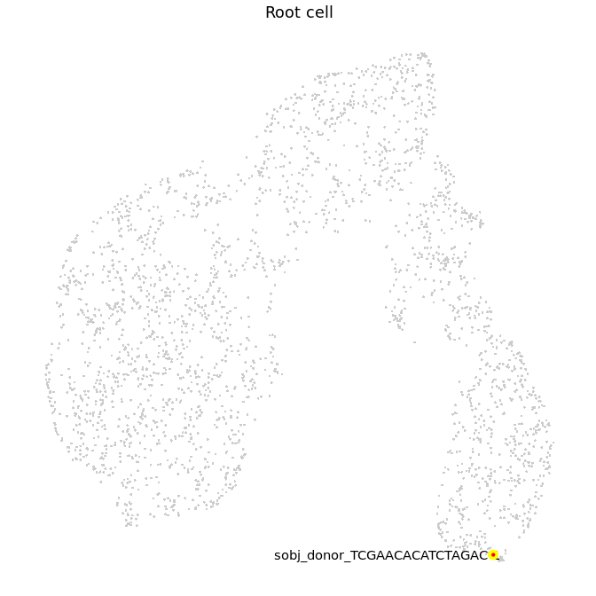
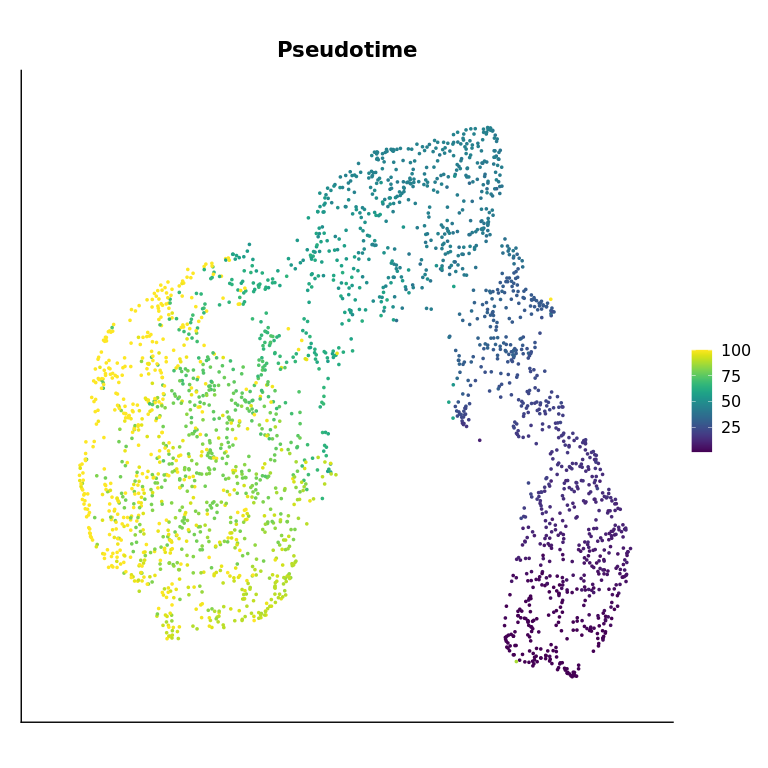
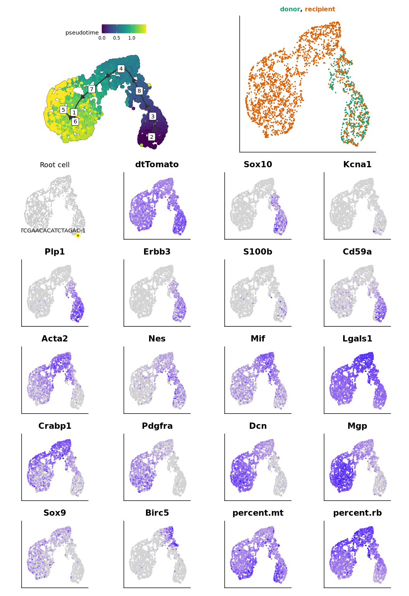
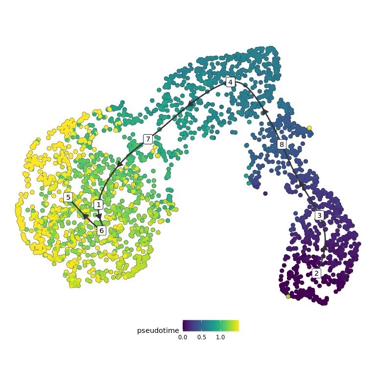

<style>
body {
text-align: justify}
</style>

<!-- Automatically computes and prints in the output the running time for any code chunk -->


<!-- Set default parameters for all chunks -->


This script is used to infer trajectory on tumor cells, using TInGa.

# Set environment


```r
library(patchwork)
library(ggplot2)
library(dplyr)
```

We load the parameters :


```r
out_dir = params$out_dir
```

We load the Seurat object containing all tumor cells from both datasets :


```r
sample_name = "donor18_recipient23"

sobj = readRDS(paste0(out_dir, "/", sample_name, "_sobj_tumor_cells.rds"))
sobj
```

```
## An object of class Seurat 
## 19179 features across 2556 samples within 2 assays 
## Active assay: RNA (17179 features, 0 variable features)
##  1 other assay present: mnn.reconstructed
##  2 dimensional reductions calculated: mnn, mnn_umap
```


This are the settings :


```r
load(paste0(out_dir, "/", sample_name, "_sample_info.rda"))

traj_dimred = "mnn"
traj_umap = "mnn_umap"
seed = 1337L
traj_max_dims = 50
```


# Trajectory inference

Where is the root ?


```r
root_cell_id = names(which.max(sobj$root_score))
sobj$is_root = colnames(sobj) == root_cell_id
sobj$cell_name = colnames(sobj)
root_plot = aquarius::plot_label_dimplot(sobj, reduction = traj_umap,
                                         col_by = "is_root", col_color = c("gray80", "red"),
                                         label_by = "cell_name", label_val = root_cell_id) +
  ggplot2::ggtitle("Root cell") +
  ggplot2::theme(plot.title = element_text(hjust = 0.5),
                 aspect.ratio = 1) +
  Seurat::NoLegend() + Seurat::NoAxes()

sobj$is_root = NULL
sobj$cell_name = NULL

root_plot
```



Now, we perform the trajectory inference :


```r
set.seed(seed)
my_traj = aquarius::traj_tinga(sobj,
                               seed = seed,
                               expression_assay = "RNA",
                               expression_slot = "data",
                               count_assay = "RNA",
                               count_slot = "counts",
                               dimred_name = traj_dimred,
                               dimred_max_dim = traj_max_dims,
                               root_cell_id = root_cell_id,
                               tinga_parameters = list(max_nodes = 8))

## Add pseudotime
sobj$pseudotime = my_traj$pseudotime
```

We can visualize pseudotime :


```r
Seurat::FeaturePlot(sobj, features = "pseudotime",
                    reduction = traj_umap,
                    cols = viridis::viridis(n = 100)) +
  ggplot2::ggtitle("Pseudotime") +
  ggplot2::theme(plot.title = element_text(hjust = 0.5, face = "bold"),
                 axis.ticks = element_blank(),
                 axis.text = element_blank(),
                 axis.title = element_blank(),
                 aspect.ratio = 1)
```



We can generate the figure :


```{.r .fold-hide}
## Make some plots
# Colored title
# https://stackoverflow.com/questions/55874998/replace-nth-occurrence-of-a-character-in-a-string-with-something-else
# https://stackoverflow.com/questions/49735290/ggplot2-color-individual-words-in-title-to-match-colors-of-groups
samples_of_interest = unique(sobj$orig.ident)
mytitle = sapply(samples_of_interest, FUN = function(one_sample) {
  one_color = sample_info[sample_info$sample_identifiant == one_sample, "color"]
  new_char = paste0("<span style='color:", one_color,
                    ";'>", one_sample, "</span>")
  return(new_char)
})
if (length(mytitle) > 7) {
  every4 = seq(from = 1, to = length(mytitle), by = 5)
  every4 = every4[-1]
  for (elem in every4) {
    mytitle[elem] = paste0("<br>", mytitle[elem])
  }
}
mytitle = paste(mytitle, collapse = ", ")
# mytitle = gsub("((?:[^,]+, ){3}[^ ]+),", "\\1\n", mytitle)

# Trajectory on UMAP
p1 = dynplot::plot_dimred(trajectory = my_traj,
                          label_milestones = TRUE,
                          plot_trajectory = TRUE,
                          dimred = sobj[[traj_umap]]@cell.embeddings,
                          color_cells = 'pseudotime', color_trajectory = "none")

# Gene of interest
p2 = Seurat::FeaturePlot(sobj,
                         features = c("dtTomato", "Sox10", "Kcna1",
                                      "Plp1", "Erbb3", "S100b", "Cd59a",
                                      "Acta2", "Nes", "Mif", "Lgals1",
                                      "Crabp1", "Pdgfra", "Dcn", "Mgp",
                                      "Sox9", "Birc5", "percent.mt", "percent.rb"),
                         reduction = traj_umap, combine = FALSE)
p2 = lapply(p2, FUN = function(my_plot) {
  my_plot = my_plot +
    ggplot2::theme(aspect.ratio = 1,
                   axis.ticks = element_blank(),
                   axis.text = element_blank(),
                   axis.title = element_blank()) +
    Seurat::NoLegend()
  return(my_plot)
})

# Sample of origin
p3 = Seurat::DimPlot(sobj, reduction = traj_umap,
                     group.by = "orig.ident") +
  ggplot2::scale_color_manual(values = sample_info$color,
                              breaks = sample_info$sample_identifiant) +
  ggplot2::ggtitle(mytitle) +
  ggplot2::theme(plot.title = ggtext::element_markdown(hjust = 0.5,
                                                       face = "bold",
                                                       size = 12),
                 axis.ticks = element_blank(),
                 axis.text = element_blank(),
                 axis.title = element_blank(),
                 aspect.ratio = 1) +
  Seurat::NoLegend() 

# Patchwork
p2[[length(p2) + 1]] = patchwork::guide_area()
p2[[length(p2) + 1]] = root_plot
p2[[length(p2) + 1]] = p1
p2[[length(p2) + 1]] = p3
p2 = p2[c(length(p2) - 3, # guide_area
          length(p2) - 1, # p1 : trajectory
          length(p2),     # p3 : sample of origin
          length(p2) - 2, # root_plot
          1:(length(p2) - 4))] # all features
mylayout = "
  #AA#CCCC
  BBBBCCCC
  BBBBCCCC
  BBBBCCCC
  DDEEFFGG
  DDEEFFGG
  HHIIJJKK
  HHIIJJKK
  LLMMNNOO
  LLMMNNOO
  PPQQRRSS
  PPQQRRSS
  TTUUVVWW
  TTUUVVWW
  "

p = patchwork::wrap_plots(p2) +
  patchwork::plot_layout(design = mylayout,
                         guide = "collect") &
  ggplot2::theme(legend.direction = "horizontal")
```

In order to save the dataset, we create a list containing everything :


```{.r .fold-hide}
output = list(traj_umap = traj_umap,
              traj_dimred = traj_dimred,
              root_plot = root_plot,
              my_traj = my_traj,
              sobj = sobj,
              p1 = p1, p2 = p2,
              p3 = p3, p = p)
```

We can visualize the main figure :


```r
output$p
```



We can zoom on the pseudotime figure :


```r
output$p1
```



Where are cells from each dataset ?


```{.r .fold-hide}
# Build plots
plot_list = aquarius::plot_split_dimred(sobj = sobj,
                                        reduction = traj_umap,
                                        split_by = "orig.ident",
                                        split_color = sample_info %>%
                                          dplyr::arrange(sample_identifiant) %>%
                                          dplyr::pull(color),
                                        group_by = "orig.ident",
                                        group_color = rep("black", length(unique(sobj$orig.ident))),
                                        bg_pt_size = 0.25,
                                        main_pt_size = 0.25)
plot_list = lapply(plot_list, FUN = function(one_plot) {
  plot_title = as.character(one_plot$labels$title)
  nb_cells = sum(sobj$orig.ident == plot_title)
  one_plot = one_plot +
    ggplot2::labs(subtitle = paste0(nb_cells, " cells")) +
    ggplot2::theme(aspect.ratio = 1,
                   plot.title = element_text(hjust = 0.5, face = "bold", size = 15),
                   plot.subtitle = element_text(hjust = 0.5, face = "bold", size = 12)) +
    Seurat::NoLegend()
})

# Patchwork
patchwork::wrap_plots(plot_list, nrow = 1)
```


We save it !


```r
saveRDS(output, file = paste0(out_dir, "/trajectory_output_tinga.rds"))
names(output)
```

```
## [1] "traj_umap"   "traj_dimred" "root_plot"   "my_traj"     "sobj"       
## [6] "p1"          "p2"          "p3"          "p"
```

# R Session

<details><summary>show</summary>

```
## R version 3.6.3 (2020-02-29)
## Platform: x86_64-pc-linux-gnu (64-bit)
## Running under: Ubuntu 20.04.5 LTS
## 
## Matrix products: default
## BLAS:   /usr/local/lib/R/lib/libRblas.so
## LAPACK: /usr/local/lib/R/lib/libRlapack.so
## 
## locale:
## [1] C
## 
## attached base packages:
## [1] stats     graphics  grDevices utils     datasets  methods   base     
## 
## other attached packages:
## [1] dynutils_1.0.5.9000  dynwrap_1.2.1        purrr_0.3.4         
## [4] tidyr_1.1.4          Seurat_3.1.5         dplyr_1.0.7         
## [7] ggplot2_3.3.5        patchwork_1.0.1.9000
## 
## loaded via a namespace (and not attached):
##   [1] softImpute_1.4              graphlayouts_0.7.0         
##   [3] pbapply_1.4-2               lattice_0.20-41            
##   [5] haven_2.3.1                 dyndimred_1.0.3            
##   [7] vctrs_0.3.8                 usethis_2.0.1              
##   [9] blob_1.2.1                  survival_3.2-13            
##  [11] prodlim_2019.11.13          DBI_1.1.1                  
##  [13] R.utils_2.11.0              SingleCellExperiment_1.8.0 
##  [15] rappdirs_0.3.3              uwot_0.1.8                 
##  [17] dqrng_0.2.1                 gng_0.1.0                  
##  [19] jpeg_0.1-8.1                zlibbioc_1.32.0            
##  [21] pspline_1.0-18              pcaMethods_1.78.0          
##  [23] mvtnorm_1.1-1               htmlwidgets_1.5.4          
##  [25] GlobalOptions_0.1.2         future_1.22.1              
##  [27] UpSetR_1.4.0                laeken_0.5.2               
##  [29] leiden_0.3.3                clustree_0.4.3             
##  [31] lmds_0.1.0                  parallel_3.6.3             
##  [33] scater_1.14.6               irlba_2.3.3                
##  [35] markdown_1.1                DEoptimR_1.0-9             
##  [37] tidygraph_1.1.2             Rcpp_1.0.9                 
##  [39] readr_2.0.2                 KernSmooth_2.23-17         
##  [41] carrier_0.1.0               gdata_2.18.0               
##  [43] DelayedArray_0.12.3         limma_3.42.2               
##  [45] pkgload_1.2.2               RcppParallel_5.1.4         
##  [47] Hmisc_4.4-0                 fs_1.5.2                   
##  [49] RSpectra_0.16-0             fastmatch_1.1-0            
##  [51] ranger_0.12.1               digest_0.6.25              
##  [53] png_0.1-7                   sctransform_0.2.1          
##  [55] cowplot_1.0.0               DOSE_3.12.0                
##  [57] TInGa_0.0.0.9000            dynplot_1.0.2.9000         
##  [59] ggraph_2.0.3                pkgconfig_2.0.3            
##  [61] GO.db_3.10.0                DelayedMatrixStats_1.8.0   
##  [63] gower_0.2.1                 ggbeeswarm_0.6.0           
##  [65] iterators_1.0.12            DropletUtils_1.6.1         
##  [67] reticulate_1.26             clusterProfiler_3.14.3     
##  [69] SummarizedExperiment_1.16.1 circlize_0.4.16            
##  [71] beeswarm_0.4.0              GetoptLong_1.0.5           
##  [73] xfun_0.35                   bslib_0.3.1                
##  [75] zoo_1.8-10                  tidyselect_1.1.0           
##  [77] GA_3.2                      reshape2_1.4.4             
##  [79] ica_1.0-2                   pcaPP_1.9-73               
##  [81] viridisLite_0.3.0           rtracklayer_1.46.0         
##  [83] rlang_1.0.2                 hexbin_1.28.1              
##  [85] jquerylib_0.1.4             dyneval_0.9.9              
##  [87] glue_1.4.2                  waldo_0.3.1                
##  [89] RColorBrewer_1.1-2          matrixStats_0.56.0         
##  [91] stringr_1.4.0               lava_1.6.7                 
##  [93] europepmc_0.3               DESeq2_1.26.0              
##  [95] recipes_0.1.17              labeling_0.3               
##  [97] class_7.3-17                BiocNeighbors_1.4.2        
##  [99] DO.db_2.9                   annotate_1.64.0            
## [101] jsonlite_1.7.2              XVector_0.26.0             
## [103] bit_4.0.4                   aquarius_0.1.3             
## [105] gridExtra_2.3               gplots_3.0.3               
## [107] Rsamtools_2.2.3             stringi_1.4.6              
## [109] processx_3.5.2              gsl_2.1-6                  
## [111] bitops_1.0-6                cli_3.0.1                  
## [113] batchelor_1.2.4             RSQLite_2.2.0              
## [115] randomForest_4.6-14         data.table_1.14.2          
## [117] rstudioapi_0.13             org.Mm.eg.db_3.10.0        
## [119] GenomicAlignments_1.22.1    nlme_3.1-147               
## [121] qvalue_2.18.0               scran_1.14.6               
## [123] locfit_1.5-9.4              scDblFinder_1.1.8          
## [125] listenv_0.8.0               ggthemes_4.2.4             
## [127] gridGraphics_0.5-0          R.oo_1.24.0                
## [129] dbplyr_1.4.4                BiocGenerics_0.32.0        
## [131] TTR_0.24.2                  readxl_1.3.1               
## [133] lifecycle_1.0.1             timeDate_3043.102          
## [135] ggpattern_0.3.1             munsell_0.5.0              
## [137] cellranger_1.1.0            R.methodsS3_1.8.1          
## [139] proxyC_0.1.5                visNetwork_2.0.9           
## [141] caTools_1.18.0              codetools_0.2-16           
## [143] Biobase_2.46.0              GenomeInfoDb_1.22.1        
## [145] vipor_0.4.5                 lmtest_0.9-38              
## [147] htmlTable_1.13.3            triebeard_0.3.0            
## [149] lsei_1.2-0                  xtable_1.8-4               
## [151] ROCR_1.0-7                  BiocManager_1.30.10        
## [153] scatterplot3d_0.3-41        abind_1.4-5                
## [155] farver_2.0.3                parallelly_1.28.1          
## [157] RANN_2.6.1                  askpass_1.1                
## [159] GenomicRanges_1.38.0        RcppAnnoy_0.0.16           
## [161] tibble_3.1.5                ggdendro_0.1-20            
## [163] cluster_2.1.0               future.apply_1.5.0         
## [165] dendextend_1.15.1           Matrix_1.3-2               
## [167] ellipsis_0.3.2              prettyunits_1.1.1          
## [169] lubridate_1.7.9             ggridges_0.5.2             
## [171] igraph_1.2.5                RcppEigen_0.3.3.7.0        
## [173] fgsea_1.12.0                remotes_2.4.2              
## [175] destiny_3.0.1               scBFA_1.0.0                
## [177] VIM_6.1.1                   testthat_3.1.0             
## [179] htmltools_0.5.2             BiocFileCache_1.10.2       
## [181] yaml_2.2.1                  utf8_1.1.4                 
## [183] plotly_4.9.2.1              XML_3.99-0.3               
## [185] ModelMetrics_1.2.2.2        e1071_1.7-3                
## [187] foreign_0.8-76              withr_2.5.0                
## [189] fitdistrplus_1.0-14         BiocParallel_1.20.1        
## [191] xgboost_1.4.1.1             bit64_4.0.5                
## [193] foreach_1.5.0               robustbase_0.93-9          
## [195] Biostrings_2.54.0           GOSemSim_2.13.1            
## [197] data.tree_1.0.0             rsvd_1.0.3                 
## [199] memoise_2.0.0               evaluate_0.18              
## [201] forcats_0.5.0               rio_0.5.16                 
## [203] geneplotter_1.64.0          tzdb_0.1.2                 
## [205] caret_6.0-86                ps_1.6.0                   
## [207] curl_4.3                    DiagrammeR_1.0.6.1         
## [209] fdrtool_1.2.15              fansi_0.4.1                
## [211] highr_0.8                   urltools_1.7.3             
## [213] rje_1.10.15                 xts_0.12.1                 
## [215] acepack_1.4.1               edgeR_3.28.1               
## [217] checkmate_2.0.0             scds_1.2.0                 
## [219] cachem_1.0.6                randomForestSRC_2.12.1     
## [221] desc_1.4.1                  npsurv_0.4-0               
## [223] rjson_0.2.20                openxlsx_4.1.5             
## [225] ggrepel_0.9.1               rprojroot_2.0.2            
## [227] clue_0.3-60                 stabledist_0.7-1           
## [229] tools_3.6.3                 sass_0.4.0                 
## [231] nichenetr_0.1.0             magrittr_2.0.1             
## [233] RCurl_1.98-1.2              proxy_0.4-24               
## [235] car_3.0-11                  ape_5.3                    
## [237] ggplotify_0.0.5             xml2_1.3.2                 
## [239] httr_1.4.2                  assertthat_0.2.1           
## [241] rmarkdown_2.18              boot_1.3-25                
## [243] globals_0.14.0              R6_2.4.1                   
## [245] Rhdf5lib_1.8.0              nnet_7.3-14                
## [247] RcppHNSW_0.2.0              progress_1.2.2             
## [249] genefilter_1.68.0           statmod_1.4.34             
## [251] gtools_3.8.2                shape_1.4.6                
## [253] HDF5Array_1.14.4            BiocSingular_1.2.2         
## [255] rhdf5_2.30.1                splines_3.6.3              
## [257] carData_3.0-4               colorspace_1.4-1           
## [259] generics_0.1.0              stats4_3.6.3               
## [261] base64enc_0.1-3             dynfeature_1.0.0.9000      
## [263] smoother_1.1                gridtext_0.1.1             
## [265] pillar_1.6.3                tweenr_1.0.1               
## [267] sp_1.4-1                    ggplot.multistats_1.0.0    
## [269] rvcheck_0.1.8               GenomeInfoDbData_1.2.2     
## [271] plyr_1.8.6                  gtable_0.3.0               
## [273] zip_2.2.0                   knitr_1.41                 
## [275] ComplexHeatmap_2.13.1       latticeExtra_0.6-29        
## [277] biomaRt_2.42.1              IRanges_2.20.2             
## [279] fastmap_1.1.0               ADGofTest_0.3              
## [281] copula_1.0-0                doParallel_1.0.15          
## [283] AnnotationDbi_1.48.0        vcd_1.4-8                  
## [285] babelwhale_1.0.1            openssl_1.4.1              
## [287] scales_1.1.1                backports_1.2.1            
## [289] S4Vectors_0.24.4            ipred_0.9-12               
## [291] enrichplot_1.6.1            hms_1.1.1                  
## [293] ggforce_0.3.1               Rtsne_0.15                 
## [295] numDeriv_2016.8-1.1         polyclip_1.10-0            
## [297] grid_3.6.3                  lazyeval_0.2.2             
## [299] Formula_1.2-3               tsne_0.1-3                 
## [301] crayon_1.3.4                MASS_7.3-54                
## [303] pROC_1.16.2                 viridis_0.5.1              
## [305] dynparam_1.0.0              rpart_4.1-15               
## [307] compiler_3.6.3              ggtext_0.1.0               
## [309] zinbwave_1.8.0
```


</details>

