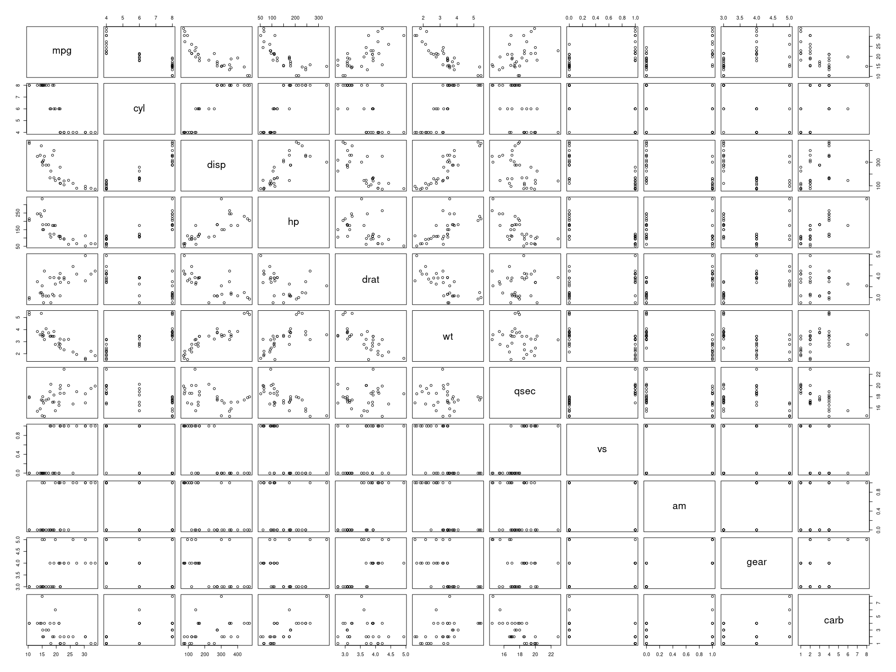

# Context

## In YML

In `html_document` options, there are :

- toc : there is a table of contents
- toc_float : toc is floating
- number_sections : section are numbered
- code folding : use `class.source = "fold-hide"` to hide code chunk, or `class.source = "fold-show"` to show
- code download : top right button to download the Rmd

## In Rmd

There are hooks in Rmd :

- `fold_output` can be set to `TRUE` or `FALSE`. If `TRUE`, there is a `show` button to show / hide a chunk output
- `fold_plot` can be set to `TRUE` or `FALSE`. If `TRUE`, there is a `show` button to show / hide a chunk plot
- `time_it` can be set to `TRUE` or `FALSE`. If `TRUE`, there is a little text after a chunk to know how many seconds it took to run

# Examples

## time_it


```r
Sys.sleep(3)
```

(Time to run : 3.01 s)

## fold_output


```r
data("mtcars")
head(mtcars)
```

<details><summary>show</summary>

```
                   mpg cyl disp  hp drat    wt  qsec vs am gear carb
Mazda RX4         21.0   6  160 110 3.90 2.620 16.46  0  1    4    4
Mazda RX4 Wag     21.0   6  160 110 3.90 2.875 17.02  0  1    4    4
Datsun 710        22.8   4  108  93 3.85 2.320 18.61  1  1    4    1
Hornet 4 Drive    21.4   6  258 110 3.08 3.215 19.44  1  0    3    1
Hornet Sportabout 18.7   8  360 175 3.15 3.440 17.02  0  0    3    2
Valiant           18.1   6  225 105 2.76 3.460 20.22  1  0    3    1
```


</details>

## fold_plot


```r
plot(mtcars)
```

<details><summary>show</summary>



</details>

## fold chunk


```{.r .fold-hide}
toto = "Hello world"
print(toto)
```

```
[1] "Hello world"
```


